## Business process framework

The Workday business process framework connects your data, security, and organizational structures to mimic real-life business workflows. This framework keeps processes consistent across Workday applications and creates centralized audit trails.

A business process controls what needs to happen, who does it, and when they do it to accomplish a transaction in Workday.

What? 🤔
Tasks, actions, and subprocesses

Who? ❓
Workday security groups

When? 🐵
Defined time frame and order

### Business process terminology

Some common business processes help you hire workers, generate expense reports, and review data entered in Workday.

- Business process type
	- A kind of workflow delivered by Workday. Examples include Hire, Termination, or Expense Report Event. You cannot add new business process types.

- Business process definition
	- A configuration of a business process type. Examples in your tenant for the Hire business process type include the Hire (Default Definition) and the Hire for Global Modern Services business process definitions.

- Business process event
	- An occurrence of a business process definition. Hire: Brady McCormick is an example of a business process event. Use the _Find Events_ or _Find Events by Date_ reports to find specific occurrences.

- Business process step
	- A task, subprocess, or other action that a user or Workday itself must complete during an event. For the _Hire_ business process, you’ll find steps like Propose Compensation Hire and Start a Background Check.

- Initiator and target
	- The initiator is the user that starts the business process event. The target is the subject of the event, such as new hires, supplier invoices, or expense reports. For the Hire: Brady McCormick event, Jared Ellis is the initiator and Brady McCormick is the target.

Elements of business process event:
1. For - The target of this business process event is the expense report.
2. Step - This event has a completed initiator step and an action step that are awaiting action. You can also view steps that were skipped because they were not required.
3. Person - The initiator for this event 

- You can also use timezones to set business process changes to take effect only after employees in a region end in their day.
	- Timezone configurations
		- workday default (PST)
		- tenant default
		- event related timezone
			- based on the timezone of the target worker or initiating user.
	- if you dont configure timezones, the tenant uses the workday default (PST)

- Run the "business process report" to return list of all business process definitions as of a specific date.
- to retrieve the business process definition, use the shortcut `bp: ${name of business process}` (bp colon).
- how workday knows what BP to use? 
	- when a user initiates a business process, workday needs to know which set of steps to follow. Workday identifies the situation and organizations associate with the target, then uses the appropriate business process.

### Business process security policies

Business process security policies control the following permissions within the business process:

- Who can start the business process
- Who can complete action steps in the business process
- Who can complete actions on an entire business process

There is only one security policy for each business process type. Edits to the policy will apply to every definition of that type, including organization-specific definitions. Use the _Business Process Security Policies for Functional Area_ report to review security permissions. This report lists all parent business processes and subprocesses for a specific functional area.

### Business process steps

#### Business process step types

Business processes use different step types to accomplish tasks in Workday. Not all step types are available on every business process type.

> 📄 report: The _Business Process Configuration Options_ report displays the step types available for each business process type.

| Step Type                       | Definition                                                                                                                                                                                                                                                                                                                                                      |
| ------------------------------- | --------------------------------------------------------------------------------------------------------------------------------------------------------------------------------------------------------------------------------------------------------------------------------------------------------------------------------------------------------------- |
| **Initiation**                  | Defines who can start the business process. It is always the first step in a business process and you cannot remove.                                                                                                                                                                                                                                            |
| **Action**                      | Either prompts users to review the process or initiates a subprocess.                                                                                                                                                                                                                                                                                           |
| **Approval**                    | Allows the user to approve, send back, or deny the entire business process, depending on the business process configuration. Approval step recipients cannot edit any information.  Note: On all approval-related steps, including consolidated approvals and approval chains, if an approver denies the approval, they deny the entire business process. |
| **Approval Chain**              | Seeks approval up a management hierarchy or organization, starting with users in the assigned security group. The chain continues until it reaches the top or meets an exit condition. A common exit condition requires approval from only two workers in the management chain.                                                                                 |
| **Batch/Job**                   | Runs the selected batch process as a business process step.                                                                                                                                                                                                                                                                                                     |
| **Checklist**                   | Sends selected users a collection of To Do steps.                                                                                                                                                                                                                                                                                                               |
| **Complete Questionnaire**      | Distributes questionnaires to gather information relevant to the business process. Not available on all business process types.                                                                                                                                                                                                                                 |
| **Consolidated Approval Chain** | Combines the properties of an approval chain with a consolidated approval.                                                                                                                                                                                                                                                                                      |
| **Edit Additional Data**        | Allows assigned users to provide data for custom fields within the context of a business process.  **Note**: Business process validation rules do not apply to this step.                                                                                                                                                                                 |
| **Integration**                 | Triggers a Workday system operation that transfers data to or from an external application. An Integration step also initiates a separate processing thread.                                                                                                                                                                                                    |
| **Report**                      | Runs a report to inform your users’ business decisions. The report appears in My Reports for the assigned users. You can also use a To Do step to consolidate links to one or more reports for the business process.                                                                                                                                            |
| **Report Group**                | Functions the same as a Report step, but for a report group, which allows multiple reports (e.g., financial reports) to run as a single unit.                                                                                                                                                                                                                   |
| **Review Documents**            | Distributes documents to workers, including custom or standard reports. You can require electronic signatures or acknowledgment.                                                                                                                                                                                                                                |
| **Service**                     | Starts a separate processing thread for a Workday-delivered service (e.g., the creation of a Workday user account).                                                                                                                                                                                                                                             |
| **To Do**                       | Sends an Inbox task to the assigned workers with instructions for a task inside or outside the Workday system. Workday does not deliver To Dos, so configure your own as needed.                                                                                                                                                                                |
| **Mass Approval**               | Provides a dashboard for multiple approvals from a single process. This step is only available for processes that deal with multiple organizations, like bonus, merit, and salary actions.                                                                                                                                                                      |
| **Shared Participation**        | Notifies and requires several workers to complete specified actions. Each of these actions is a participant detail event.                                                                                                                                                                                                                                       |

Note: You can customize the delivered name of a step from the step's **Related Actions** by selecting **Business Process** > **Maintain Step Label** **Override.**

#### Order of execution

In the Order column, you’ll notice there are lowercase letters sorted alphabetically. Use these letters to configure the order that your business process steps should execute. 

- Use multiple letters to insert new steps in an existing order. For example, “a, b, ba, bb, c” will run in that order.
- Skip letters if necessary. For example, “a, b, d” will run in that order.
- Steps with the same letter will complete in parallel. Users can complete parallel steps in any order.
- Some steps may be subprocesses. Subprocesses follow the same rules, but contain their own steps and configurations.

You determine which step is the completion step. The completion step signals to Workday that the business process status should change to Successfully Completed. The process can contain other steps after the completion step, but all approval and review steps must come before the completion step.

To set a completion step, select a step’s Related Actions, then Business Process > Set As Completion. If there isn’t a completion step, the business process marks as complete when the last step finishes.

#### Compare business process definitions

**Default definition**

In the image below, you’ll notice the _Change Benefits for Life Event_ default in this tenant is an initiation step and then an approval. A member of the Benefits Partner security group completes the approval step, which completes the business process.

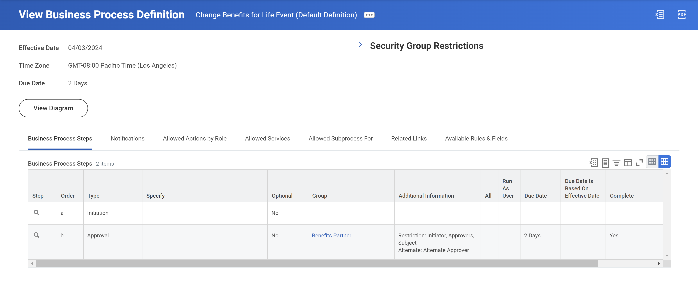

**Organization-specific definition**

Global Modern Services uses their own, organization-specific definition for this business process. In the image below, notice that this definition starts with an initiation step followed by several to do steps. 

In step ‘c’ Workday identifies if a worker is located in the United States or Canada. If the answer is yes, the worker must provide evidence of insurability. Next, there are several ‘d’ parallel steps. Depending on a worker’s reason for requesting a benefits change, GMS adds applicable to do items. 

Notice that the initiation step actually completes the business process. There’s no approval step, so once the worker makes this request, they’re notified to complete any necessary documents and the process is complete.

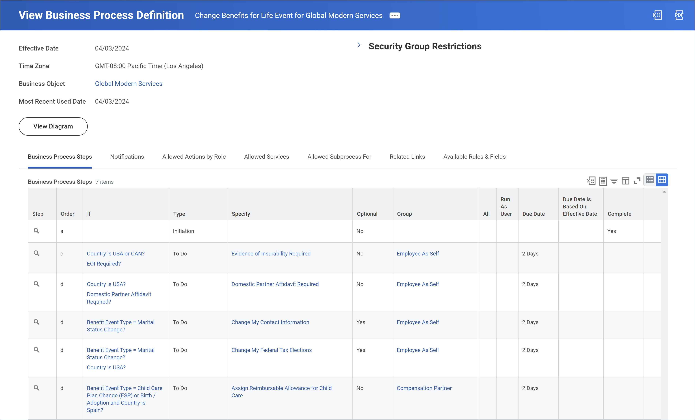

### Key takeaways

- A business process controls what happens, who does it, and when they do it.

- A business process definition is the configuration of a business process type. A business process event is a single occurrence of a business process definition.

- The initiator starts the business process event and the target is the subject of the event.

- Business process security policies control who can complete each step of a business process definition.

## Business process configuration

### View vs Edit mode

#### view mode

When viewing a business process definition, you can add and maintain certain features. By selecting a step’s Related Actions and then Business Process, you can set a step as completion step, or add certain step conditions or advanced routing. In View mode, you can’t change the actual steps themselves.

Tabs on the business process definitions:
- **Business process steps** -  Tasks and actions designated to occur in a specific sequence or in parallel
- **Notifications** - Alerts in Workday or via email sent to specified participants on entry or exit of step, or when the status of the business process changes
- **Allowed actions by role** - List of actions, like approve, cancel, or rescind, allowed for the business process type
- **Allowed services** - List of Workday-generated services allowed on the business process as Service steps
- **Related links** - Links to external web pages shown to workers at some point in the business process
- **Available rules and fields** - Displays condition rules and report fields that you can use within the business process steps

#### edit mode

To make edits to a business process definition, select its Related Actions then select Business Process > Edit Definition. The effective date will default to today's date, but you can also future date your changes. You cannot back date business process definition edits.

From Edit mode, you can add, modify, or remove steps. You can also configure the order, group, due date, and indicate whether or not the step is required.

### Business process configuration options

Each business process type has different allowed configurations. You can review the allowed features for each type in the Business Process Configuration Options report.

Use this report to plan and configure your business processes. The report provides information on process configurations, including:

- Organization types that are valid for this business process type usage
- Allowable actions and approvals
- Options on saving after an available action
- Restrictions such as before completion only or after completion only 
- Prerequisite actions
- Business processes that are strictly subprocesses
- Allowed subprocesses for business process types
- Allowed mass actions, like rescind, correct, cancel, and approve
- Incomplete business processes that are cancelable

### Common business process steps

#### Action service steps

Action steps either send users reviews of information or start a subprocess. Review steps allow the user to edit the business process data and approve it.

A service step starts a Workday-delivered, automated process as part of the business process.

**Examples of action and review service steps:**

- Change organizations assignments for worker BP
	- The employee changes their benefit elections if there’s also a company change.

- Change business title BP
	- The Manager reviews a change to a worker’s title before HR approval.

- Expense report event BP
	- The Expense Partner reviews every fifth expense report.

- Customer invoice email event BP
	- The Accounts Receivable Specialist reviews the customer invoices.

- Create workday account service
	- Automatically creates a user account and emails a temporary password to the new user.

- Document delivery service
	- Transports an integration output file to an external server.

#### Approval Steps

You will frequently use Approval steps in business process definitions to share data with and get approval from necessary users. There are several different types of Approval steps, such as approval, approval chain, and mass approval. 

Approval steps allow the assigned user to approve, send back, or deny a task, depending on the business process configuration. Each member of the assigned security group will receive the approval step. You can also add additional approvers to an event while it is in progress through Ad Hoc Approval. The business process will move forward when one member approves the step, unless you have selected the All option, which requires each user to approve.

| Response  | Definition                                  |
| --------- | ------------------------------------------- |
| Approve   | Moves to the next step or completes process |
| Send Back | Sends to previous step with comments        |
| Deny      | Terminates process                          |

Note: To make it clear what action is required, select a business process's **Related Actions**, then select **Business Process** > **Maintain Help Text**. From here, you can add help text to each business process step where it's needed.

### Activity notes

**Tasks and reports:**

- use `bp: hire for IT` to search for associate business process
	- Edit the BP definitions by: Related actions -> Business process -> Edit definition
- When adding steps to the business process, click on the plus icon ➕ -> and define the order of the step
- To set a step as completion action, click on the magnifying glass icon 🔍 -> related actions -> business process -> Set as completion.

### Key takeaways

- View mode allows you to set a completion step, and add step conditions or advanced routing. You'll use Edit mode to add or make changes to  business process steps. 
    
- Action steps either send users information or start a subprocess. Review steps allow users to edit and approve business process data.
    
- Approval steps allow the assigned user to approve, send back, or deny a task.

## Business process advances features

### Condition rules

When you create a condition rule, it can include one or more "and/or" statements. These statements may be complex and can include parentheses to control the order of operations. The image below shows an example of a condition rule. In order to consider a user at management level, they must be an employee and one of three management levels.

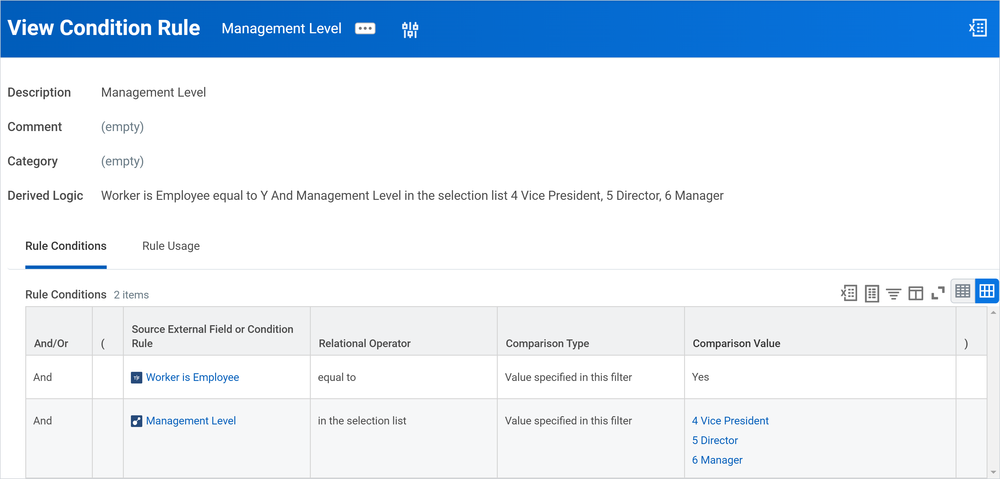

### Creating condition rules

Step 1: Locate the business process definition and select it to review the information in View mode.

Step 2: From the step’s Related Actions, select Business Process > Maintain Step Conditions

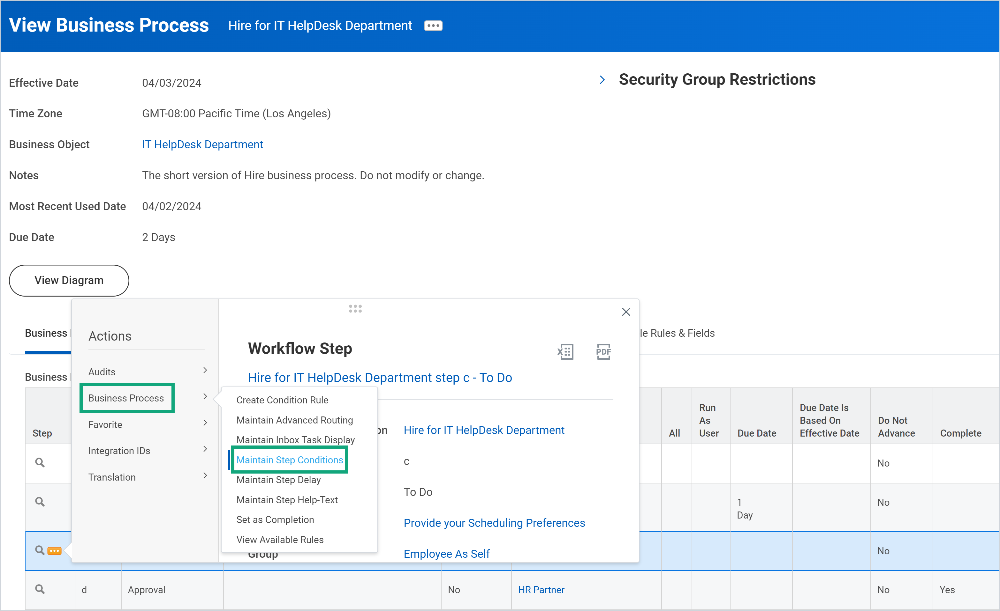

Step 3: Add your condition rule or rules. If a rule does not already exist, create it by selecting the empty rule field > Create Condition Rule.

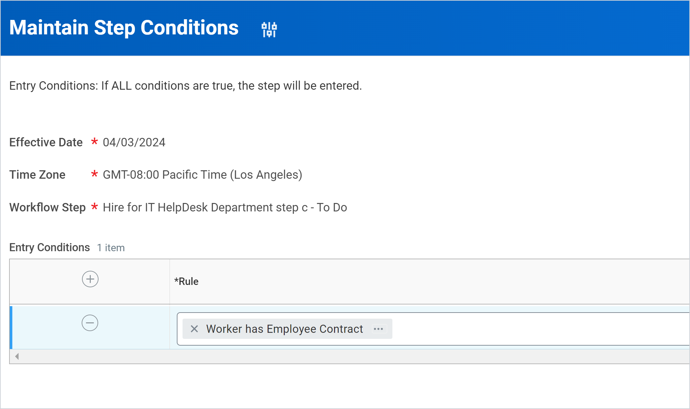

### Routing and notifications

#### advanced routing

Advanced routing restrictions secure and streamline business processes. You can use these restrictions on all business process steps except Initiation and Checklist steps. Whereas condition rules exclude users and groups regardless of an event’s details, advanced routing restrictions exclude or designate an alternative based on a user’s interaction with an event. If routing restrictions exclude all assigned workers from a step, the process skips the step.

Compare the three routing restriction options in the table below.

| Routing Restrictions    | Definition                                                            |
| ----------------------- | --------------------------------------------------------------------- |
| Exclude Initiator       | Excludes the worker who initiated the event.                          |
| Exclude Prior Approvers | Excludes any workers who previously approved any step of the process. |
| Exclude Event Subject   | Excludes the worker if they are the event’s target object.            |

To create a routing restriction, navigate to the business process step’s Related Actions and select Business Process > Maintain Advanced Routing. Choose an effective date and a time zone. Finally, select the routing restriction or restrictions you want to apply. You can also specify the alternative security group you’d like to include.

#### Notifications

There are two types of notifications you can add to a business process step: system and custom. System notifications inform users when they have a new task. 

Custom notifications appear in Workday on the Notifications icon. Workday can send a custom notification when the status of a business process changes, or upon entry or exit from a step. You can configure the message content section to include specific text or report fields, such as Hire Date or Amount.

To create a notification, select the business process definition’s Related Actions, then select Business Process > Add Notification. You’ll choose an effective date and time zone. Then, choose your trigger, recipients, and any conditions or rules you want to include. Finally, enter values for your message's subject and body text. Once complete, you can preview your custom notification.

### Key takeaways

- A condition rule uses "and/or" statements to control business process steps.
    
- Validation conditions check the accuracy of data in Workday. 
    
- Entry conditions determine whether a step needs to occur, while Exit conditions determine whether the step is complete.
    
- While Running conditions apply to approval steps where Workday needs to determine whether the next user in the management chain needs to approve the step.
    
- Use advanced routing to exclude an initiator from completing a step, and notifications to alert users that they need to complete a task.

## Testing business processes

### Business process testing tools

#### Testing business process step execution

It’s important to test your business process definition as you make changes to it. Use the following steps to test business process step execution. 

1. Review the steps of the business process and make a list of scenarios that will test each variation. For example, if a proposed compensation change needs additional approval for proposed increases over 20%, you’ll want to test a proposed change under 20% and one over 20%.

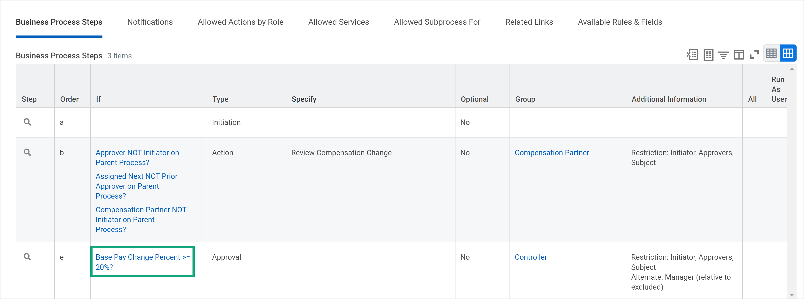

2. Use proxy access to complete each step of the business process. After each step, select View Details from the pop-up window and review the Process tab to track each completed step. You can also view a list of remaining steps and the people with the access to complete each one. Note any irregularities as you test.

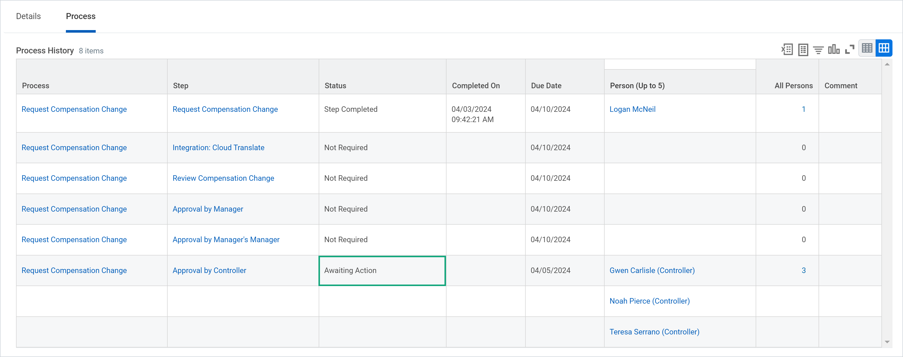

3. Ensure that the business process status changes to Successfully Completed when expected. If there are steps after completion, test that those execute correctly.

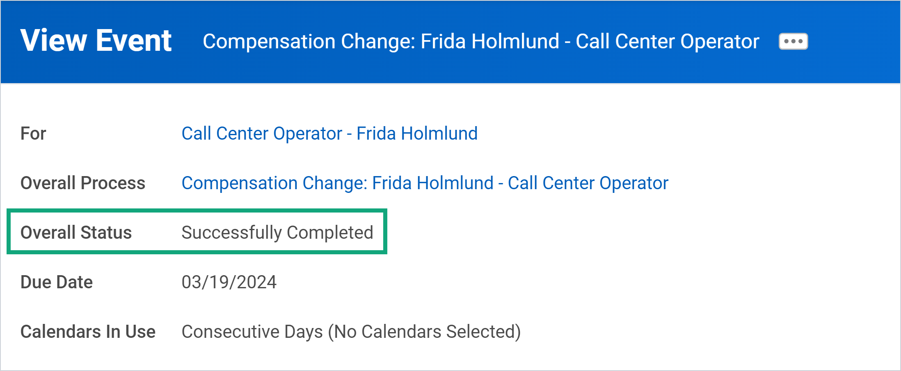

4. Repeat steps 2-4 until you’ve tested each scenario. If the business process didn’t behave as expected, review the definition to determine what changes you need to make. Then, retest with the changes in place.

#### Security policy change control

You can use change control to review changes made to business process security policies. The following reports are available to find business process security policy changes:

- Business Process Security Policies with Pending Changes
- Business Process Security Policy History
- Business Process Security Policies Changed within Time Range

Using these reports, you can change the status of a business process security policy, or activate a previous security timestamp. Remember to use the _Activate Previous Security Timestamp_ task to revert back to an earlier security policy.

#### Condition rules tester

You can troubleshoot condition rules with the _Rule Tester_ task. To do this, select a business process event's Related Actions, then select Business Process > Test Rule. You’ll select a business process’s condition rule to test. Then, the Rule Tester will display each condition of that rule and the result.

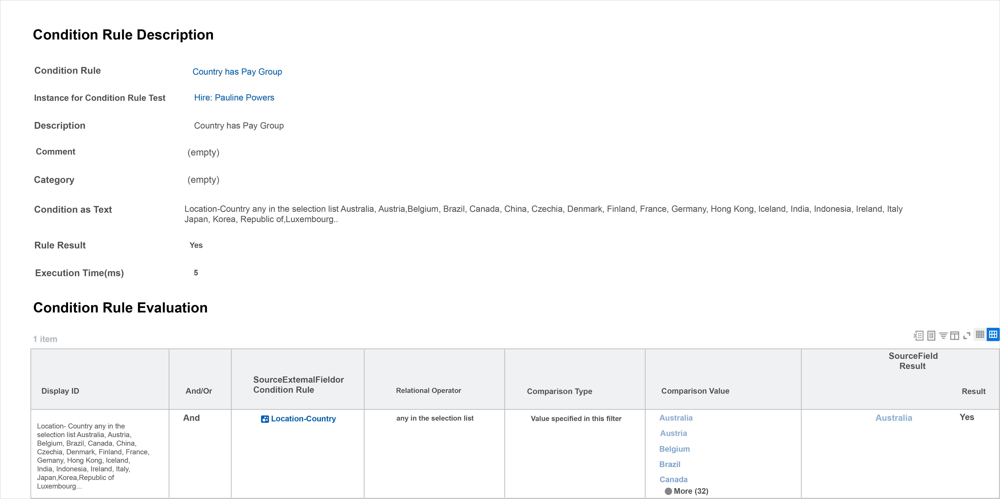

You can only access this task from events that use a condition rule. You'll also need access to the Business Process Administration domain.

### Activity notes

#### testing events

- navigate to "find events" report -> enter "hire" as the business process name.
- on the related actions -> select business process -> test rule.
	- using the search field, search for the target rule that you want to test:
		- Examples: `Country has pay group`, `Country with collective agreements`, and `Proceed to onboarding`.

### Key takeaway

- When testing a business process, you should make a list of scenarios to test each variation, use proxy access to complete each business process step, and ensure the status changes to Successfully Completed.

- Use the Activate Previous Security Timestamp task to revert back to an earlier security policy.

- The condition rule tester displays the result of a condition rule for a business process event, which helps you troubleshoot issues.

## Troubleshooting business processes issues

### Business process troubleshooting tools

When troubleshooting business process issues, there are a few reports that will help you audit your business process events.

| Report Name                                           | Description                                                                                                                                                                                              |
| ----------------------------------------------------- | -------------------------------------------------------------------------------------------------------------------------------------------------------------------------------------------------------- |
| Business Process Exception Audit                      | Returns every business process with an exception with the type of error, the problem message, and the proposed solution message.                                                                         |
| Business Process Transactions of Type Awaiting Action | Returns every business process that is awaiting action, who it is waiting for, how long it has been waiting, and how many days past due. Optionally, you can delegate the awaiting task to someone else. |
| Unassigned Tasks                                      | Returns business processes that are stuck waiting for the completion of an unassigned task. Used to review and reassign steps.                                                                           |
| View User or Task or Object Audit Trail               | Returns business process event comments that were removed. Used to audit business process events and find more information associated with the event.                                                    |

The reports above are available to the Business Process Administrator security group. You can use these reports to figure out why a business process has stalled and then correct the issue.  Here are two reasons a business process might stall:

- a business process is waiting on an action that is past due. To solve this, you send a reminder to the user who needs to complete it.
- A manager who needs to approve a task is on extended PTO. To solve this, you reassign the task to another manager.

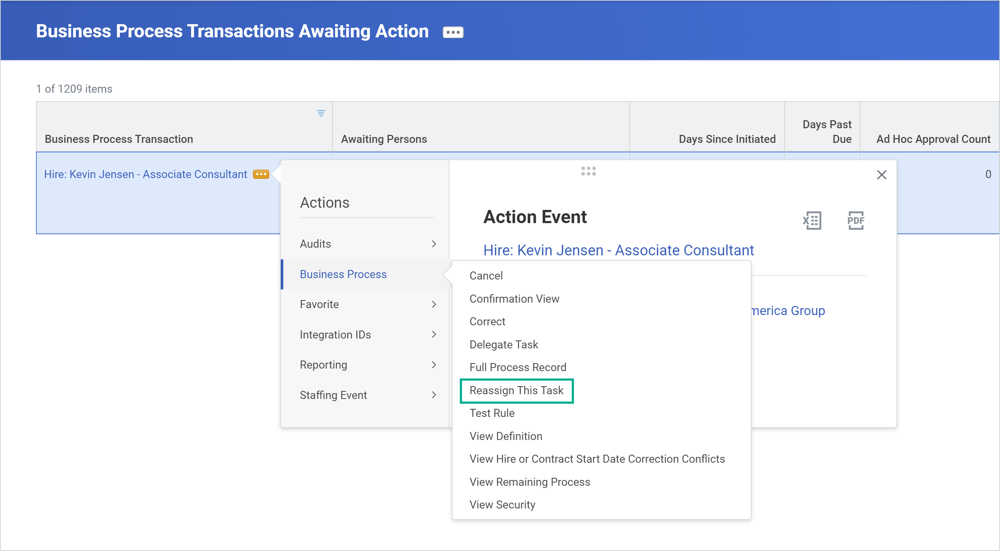

### Troubleshooting condition rules

When condition rules do not act as expected, run the _Report Fields and Values_ report to determine what fields have values at the time an event is executed. You can access this report by selecting an event’s Related Actions > Reporting > Report Fields and Values.

### Activity notes: Business Process not complete

- use the "Business Processes Awaiting Action" report to find the Manage Mentorship business processes awaiting action.
- when on the transaction, select the process tab and investigate on which step are "blocked"
- proxy as the workers to complete the blocked steps. you may have to do the steps in place to the worker to complete them
- proxy as workers and inspect the business process (use the main event table) to view the remaining steps on the business process.

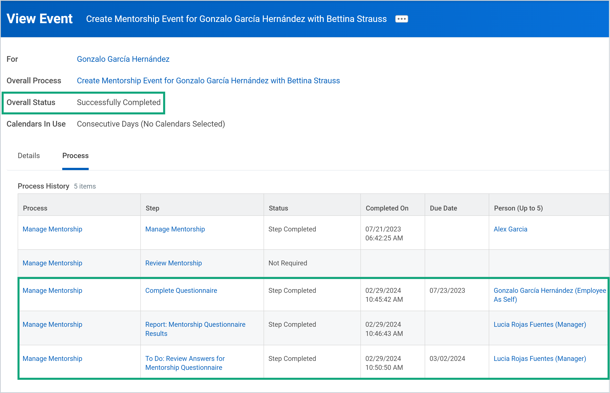

### Activity notes: modify business process security group

- navigate to "view security for securable item" report. enter "time off correction"
- search for "correct time off business process". on the business process related actions -> select business process policy -> edit
- find the section: "who can do action steps in the business process". and add the "administrative assistant" security group.
- click "ok" and then head to "activate pending security changes" task. Enter descriptive comment and then confirm.
- test: navigate back to the business process definition. 
🚧

### Key takeaways

- Use the _Business Process Transactions of Type Awaiting Action_ report to find business processes that have not completed.
- The _Unassigned Tasks_ report allows you to reassign steps that are stuck waiting for an unassigned task to complete.
- If a condition rule does not act as expected, use the _Report Fields and Values_ report to determine what the values were used for each field at the time an event executed.

