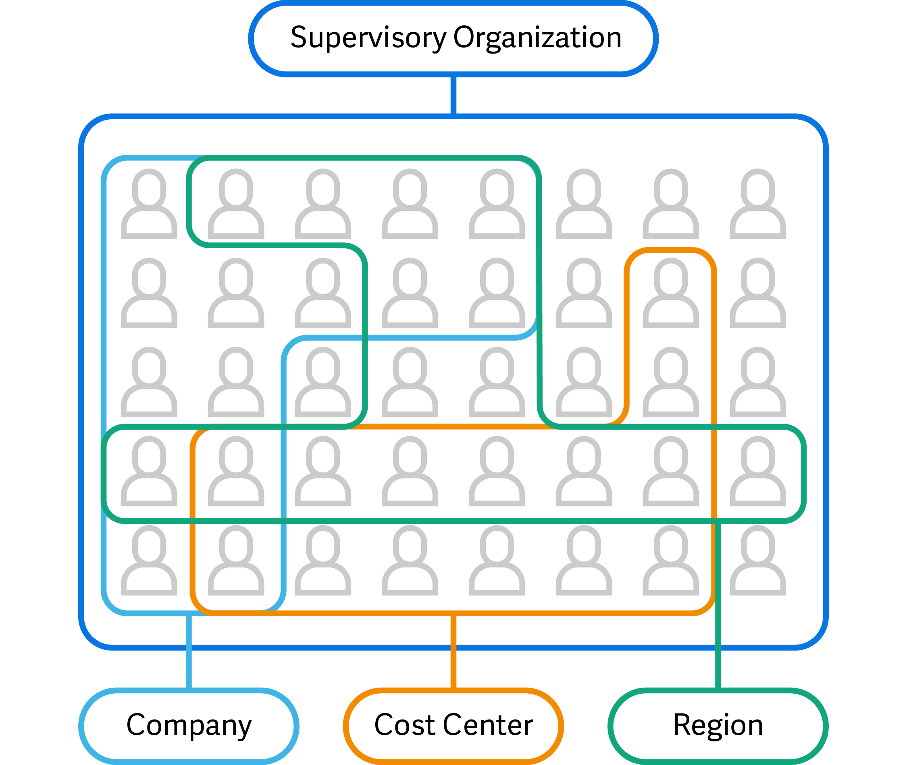

> ⚠️ Warning:
> Check email for information about the availability to workday training tenant.
> - Training tenant has start and end date, so plan to finish the course accordingly before tenant expires.

## Workday basics

1. navigating the system
2. Modifying security access
3. Configuring workflows
4. Using report writer

## Module 1: the workday platform

### Introduction to workday products

Unified system - one source of truth.
	- enhances reporting and makes processes easier to manage.
	- 

Workday products:
1. Financial management - Accounting, payables, receivables, cash and asset management, auditing, analytics, reporting, and more.
2. human capital management - HR, employee experience, help, knowledge and case management, planning, compensation, and benefits.
3. Workday adaptive planning - Financial, workforce, sales, and operational planning, as well as analytics for the entire enterprise.
4. Spend management - Expenses, procure-to-pay, strategic sourcing, and inventory management.
5. Talent management - Talent acquisition, learning, and performance optimization.
6. Payroll and workforce management - Scheduling, time and attendance, absence management, and payroll.
7. Analytics and reporting - Financial, workforce, and operational analytics; benchmarking; and data management.
8. Student - Admissions, financial aid, student records, advising, and more.
9. Professional Service Automation - Project and resource management, billing, time tracking, expenses, and more.
10. Platform and product extension - Solutions for extensibility, including app development and integrations.
11. workday peakon employee voice - Real-time employee engagement, sentiment, and productivity insights, including industry benchmarks.
12. Workday VNDLY - Extended workforce management, statement of work, and worker profile management.

#### Function areas

Each Workday solution contains groupings of distinct functional areas. Functional areas contain all the items you need to deploy a given area of Workday. 

For example, Workday Human Capital Management or Workday HCM includes Performance and Goals, Onboarding, and Time Off and Leave. Workday Financial Management includes the Financial Accounting and the Customer Accounts functional areas. Each functional area is then divided into business process types and domains.

#### Workday community

The Workday Community is an interactive platform that supports your journey with Workday applications. It offers resources for an introduction to Workday, helps you prepare for deployment, and provides ongoing support for feature releases, adoption, and deployments. From here you can also learn more about our training offerings, access Workday Support for service issues, and explore offerings like Workday Success Plans, Expert Assist, and Office Hours.

#### Workday touchpoint kit

❓Collection of diagrams, heatmaps and organizational details that illustrate the relationships across all product areas within the workday suite. 

- Touchpoint diagrams - Illustrate the data flows between functional areas as well as third party sources
	- provide source of truth.
- Design heatmaps - data visualization that explains the weight and importance across design considerations.
- Organizational details - summarize the importance of organization to each product area with named primary owners for each organization type.

Reference: `community.workday.com/tpk`

#### Summary

- The Workday platform encompasses many products, including: Adaptive Planning, Analytics & Reporting, Financial Management, Human Capital Management, Payroll, Platform and Product Extensions, Spend Management, Student, Talent Management, Workday Peakon Employee Voice, Workday VNDLY, and Workforce Management.
- The Workday products align to corresponding functional areas.
- The Workday Community is an interactive, collaborative environment designed to deepen your Workday knowledge and connect with others in the Workday ecosystem.
- The Workday Touchpoints Kit offers diagrams, heatmaps, and organizational details to help display all data flows and configuration relationships within Workday.

### Workday navigation

#### Introducing Business object model

Business object model:
- Workday is an object management system (OMS)
- Database management system that supports modeling and creating data as objects.
- Workday stores data, or business objects, as fields and instances rather than columns and rows.
- Workday also automatically links business objects together to create relationships.
- Workday is not "menu-driven". Instead, workday uses objects that allow you to act on data.
	- Means that for most objects in workday, you can perform actions on that object right from the object itself.
- In workday, objects are related to one another. This means that you can quickly and easily navigate to and act on data without having to search through a series of menus.

Ways to perform actions on objects
1. Workday hyperlinks many objects, which means that you can select and click on the object themselves to navigate directly to the object's page.
2. Select an object's related actions icon to display a menu with actionable tasks.

> ℹ️ Info:
> Sometimes, depending on where the related actions menu displays on a page, the object might display as an actions button instead of a related actions icon. Regardless of appearance, they provide the same functionality.

#### Workday homepage

- **Global navigation menu** - The Menu icon opens the Global Navigation panel. This menu intuitively enables users to navigate across the system. You can use the global navigation menu to consistently access tasks, reports, and applications, anywhere in Workday.
   This benefits users who may be unsure of keywords to use when searching Workday. You can display up to 20 apps.
   You can also customize and include any shortcuts.

- **Workday Logo** - Selecting the Workday Logo will return you to the Workday-delivered Home landing page. You can also use the _Change Preferences_ task to select a different Preferred Home Page.

- **Search** - Enables you to find and go directly to tasks and reports.

- **Workday assistant** - Your organization might have Workday Assistant enabled. If so, Workday Assistant is a chatbot that provides customized responses, enabling you to surface the most relevant tasks. This feature recognizes natural-language queries, locating tasks and reports you don’t know the exact names for. 
  Both desktop and mobile versions of the Assistant tool are accessible within Workday.

- **Notifications** - Displays a badge count for your unread notifications and takes you to your Notifications page.

- **Inbox (my tasks)** - Displays a badge count for your incomplete Inbox items and takes you to your Inbox.

- **Profile photo** -  You can select your profile photo to access many options on the main navigation menu, such as: 
	- Drive
	- My Reports
	- My Account

- **Banner** - You can customizable the banner that displays at the top of your page. You can display different banners for certain groups of employees or have the banner automatically rotate throughout the day.

- **Greetings message** - The dynamic greeting message can rotate throughout the day, depending on the time users sign in.

- **Awaiting your action** - The Awaiting Your Action section displays up to four of the most recent items. This includes Inbox items and journey items or additional cards, if applicable. Select the ellipsis to remove Inbox items from displaying. 
  Note that if your organization has not enabled the Inbox and the user has no Journeys, this section won’t display.
  
- **Cards** - Cards are dynamic pieces of content that appear on the Home page. Your organization can customize the information cards Workday displays on the Home page, increasing employee engagement and delivering relevant information in a timely manner. 
  You can use the _Home Cards Workspace_ report to add any combination of cards to your employees' and students' Home pages. However, you can't change which section each card displays in.

- **Your top apps** - Your Top Apps section displays the first four apps or worklets from the View All Apps section and the Global Navigation menu. 
  Selecting View All Apps displays worklets and external links. You can use the _Maintain Dashboards_ report to configure worklets and external links for the Home dashboard. Worklets display in the order that users specify when configuring the Global Navigation menu on the Home page.

- **Announcements** - The Announcements section displays three announcements by default. You can select View More Announcements to display additional items. When you select an announcement, a pop-up card appears where you can take additional actions. 
  For example, you can open a link to a new browser or navigate to a task within Workday. Announcements can also display an embedded video.

- **Timely suggestions** - The Timely Suggestions section displays up to three various cards configured by your organization, with an option to view more cards. These cards can display actionable insights delivered from Workday data or external data. 
  For example, employees can quickly access available paystubs or new learning courses that are due.

- **Recommended for you** - The Recommended for You section displays the Explore Org Chart and View Your Profile cards, by default. You can personalize this section by adding one or more relevant cards, or removing this section by unpublishing the cards.

> ℹ️ Info:
> Accessibility in Workday is available to all users upon signing into Workday. This doesn't require any additional configuration in the _Edit Tenant Setup_ tasks. Workday Accessibility optimizes tasks for users on assistive technology. You can familiarize yourself with accessibility in the Workday user interface, by accessing the _Accessibility Interaction Overview_ task.  
> 
> To improve legibility, you can enable blue buttons in any tenant. Access the _Edit Tenant Setup - System_ task and select Enable Blue Primary Buttons.

**Additional things to note:**
- As a workday administrator: you can also modify the global menu of your workday tenant.
- As a workday administrator: you can also modify workday delivered cards on your organization. 
	- You can do this through the "home cards workspace" report using the search bar.
	- The home cards workspace report provides you with central place to create and configure home page cards.
	- 💡reminder: you can't change which section the cards and links display in. Any card that you'll add will appear in it's corresponding section.
	- External cards:
		- ⚠️ Keep in mind that your organization must enable workday journeys in order to use external cards.
	- 

#### Search and navigation

Workday provides powerful search capabilities allowing you to quickly access tasks, reports, business objects, and more. When you use the Search box in the application header to perform a search, Workday displays type-ahead results and saves your recent searches.

##### Predictive search

Predictive Search functionality provides you best-matched search results with minimal typing. Using the Search box, enter at least three characters to display predictive suggestions. Workday processes each term or character string separately. 

So, if you enter two terms separated by a space, the system searches for objects containing both terms regardless of whether the terms are next to each other. Note that search suggestions and results are based on your security permissions. 

  

**Predictive Search best practices:**
- Keep searches simple.
- Avoid general terms like "find," "edit," "maintain," or "create." Using a general term returns more results, making it harder to find what you are searching for. 
- Search for multiple terms to narrow down your search.

##### Exact match

Use Exact Match to search for a specific item. Workday returns the exact match first, in addition to any other similar results. Typically, Exact Match is used for employee IDs, emails, and phone numbers.

For example, if you search for Gail Bradley’s employee ID, 21097, the system returns one result: Gail Bradley’s employee object.

##### Prefixes

Search prefixes restrict search results to a particular type of Workday object, quickly narrowing down results. For example, the "bp" search prefix restricts search results to business process definitions. To view a report of all search prefixes, enter a question mark (?) in the Search box.

Here are some common search prefixes to get you started. Make sure you enter a colon (:) after the search prefix, followed by your search term.

| Search Prefix | Object Type Returned        |
| ------------- | --------------------------- |
| org           | Organization                |
| bp            | Business process definition |
| loc           | Location                    |
| field         | Report field                |

##### Global Search

Global Search is a core navigation tool in Workday. The Global Search Results page contains the following key areas:

| Term             | Definition                                                                                                                                                                                                                                                                                                                     |
| ---------------- | ------------------------------------------------------------------------------------------------------------------------------------------------------------------------------------------------------------------------------------------------------------------------------------------------------------------------------ |
| Saved Categories | Saved categories produce faster and more accurate results tailored to a specific area of interest. On the Search Results page, select a search category from the categories panel on the left side of the screen.       Workday automatically displays the saved categories: Articles, People, Tasks, and Reports. |
| More Categories  | Additional categories that users can select to filter the search results. You can add any of the items in More Categories to your Saved Categories.                                                                                                                                                                            |
| Configure Search | You can customize search categories for each user. Drag and drop to reorder your saved and more categories.                                                                                                                                                                                                                    |
| View Search Tips | Tips on better ways to search. This includes information about how to use prefix words and a list of all prefix words.                                                                                                                                                                                                         |
| Search Results   | Suggested results display the most relevant results, based on the categories selected.                                                                                                                                                                                                                                         |

##### Things to note

- Configuring personal search:
	- This will only affect "your" view of the search results and not the whole organization.

##### Standard screen icons

| Icon                    | Description                                                                                                                               |
| ----------------------- | ----------------------------------------------------------------------------------------------------------------------------------------- |
| Workday Logo icon       | Brings you back to your Home page.                                                                                                        |
| Profile Image icon      | Opens all sections available from the Worker Profile Menu when you select your photo from the Home page.                                  |
| Related Actions icon    | Displays the Related Actions menu for an object (available only if the user has permission to perform additional actions on that object). |
| Inbox icon              | Opens the Inbox, which includes both pending and archived tasks.                                                                          |
| Notifications icon      | Opens your notifications.                                                                                                                 |
| Prompt icon             | Displays apps and configured shortcuts.                                                                                                   |
| Actions icon            | Opens the Related Actions menu for an object.                                                                                             |
| Filter icon             | Add a filter to your data.                                                                                                                |
| PDF icon                | View this page as a PDF file that you can print. Restrict this option using the Export to PDF and Excel domain.                           |
| Excel icon              | View this page as an Excel file. Restrict this option using the Export to PDF and Excel domain.                                           |
| Worksheets icon         | Send the report to a Workday worksheet.                                                                                                   |
| Column Preferences icon | Freeze columns, similar to Excel.                                                                                                         |
| Fullscreen icon         | View more data with full screen toggle.                                                                                                   |
| Chart icon              | Indicates that you can view a report as a chart.                                                                                          |
| Change Selection icon   | Returns to the previous page, and allows you to return a report or task with new values.                                                  |
| Sort icon               | Change the sort direction. An up or down arrow appears in the column heading of a report.                                                 |
| Gear icon               | Appears in applications, worklets, and landing pages, and acts as a menu or settings option.                                              |
| Search icon             | Opens the associated instance.                                                                                                            |
| Alert                   | Alerts you to system limitations based on configuration. You may continue your process or configuration when an alert message displays.   |
| Error                   | Alerts you to a critical error. Correct an error to move forward in a process or to enable your configuration                             |

##### Task page icons table

| Icon                  | Description                                                                                |
| --------------------- | ------------------------------------------------------------------------------------------ |
| Asterisk              | Indicates that you must enter a value for this field before saving or submitting the page. |
| Menu icon             | Displays a list of available values sorted in folders (if applicable).                     |
| Calendar icon         | Opens a calendar to select your date.                                                      |
| Remove Row icon       | Removes the current row from a grid.                                                       |
| Add Row icon          | Adds a row to a grid.                                                                      |
| OK button             | Accepts your changes.                                                                      |
| Submit button         | Accepts your changes and moves you to the next step in the business process.               |
| Done button           | Closes a confirmation screen.                                                              |
| Cancel button         | Disregards all changes.                                                                    |
| Save for Later button | Saves the item in your Inbox until you act.                                                |
| Related Actions icon  | Gives you additional choices, depending on the user and the business process.              |

##### Prompts, single and multi-select fields

**Prompts**

Workday uses prompts to help users navigate in search fields. Prompts display folders of all content available to that field, so you can navigate through these groupings to find information more easily. As you navigate through prompts, the top of the pane displays which folder level you are currently in and allows you to return to a previous level. If the prompt only contains one folder or available level to choose, it will default to open. If a field displays a prompt list icon, you must use one of the prompt values.

**Multi-Select Fields**

If a field permits more than one value, the prompt list stays open to allow you to choose as many values as necessary. Workday displays multi-select options as a square checkbox. The field expands as you enter additional values, and you can select the X to remove entries.

**Single-Select Fields**

In single-select fields, you can only select one value, and the prompt list will disappear once you choose a value. Workday typically displays single-select options as a circular checkbox. However, there are some instances where a single-select prompt will display as a square checkbox.

### Organizations in workday

An organization is a basic building block in Workday. Organizations are defined to group together resources, workers, and costs to support a particular business function. Workday defines and delivers the most common types of organizations.

Each organization type tracks different information. You can create an unlimited number of each organization type to use for your different reporting needs.

- Supervisory organizations track workers.
- Cost center organizations track financial transactions.
- Company organizations provide a vehicle for statutory reporting.

You can define each organization type to reflect your business requirements. Use the *Maintain Organization Types* task to establish each organization's functionality.

#### Organization types

1. **Academic unit** - Provides the basis to manage faculty appointments in education.

2. **Business Unit - Typically used to reflect lines of business that might cut across multiple companies or legal entities.

3. **Company** - Represents a legal entity and ties to all financial transactions. A primary organization type for Workday Financial Management. You can use company organizations to generate most financial reports, such as balance sheets and income statements. Workday recommends that you create a separate company for each internal entity with a separate tax ID.

4. **Cost center** - Used to track and report on revenue and expense-related financial transactions. Cost center organizations also track and report on Workday HCM transactions with financial impacts, such as hiring and terminations.

5. **Location** - Used to group workers by their physical work location rather than an area of responsibility. Locations are an attribute that you can associate with a worker, supervisory organization, or position. You can also use location organizations to track assets.

6. **Region** - Used to reflect a worker's area of responsibility instead of the worker's physical work location. Region organizations are customer-specific.

7. **Pay group** - Groups workers with similar payroll processing parameters and aggregates workers and the rules that govern pay calculation. Workers in the United States, Canada, and France who receive pay through Workday Payroll must be members of exactly one pay group, unless you use multiple jobs functionality.

8. **Supervisory organization** - Groups workers into a management hierarchy. A supervisory organization has assigned manager and support roles. By hiring, contracting, or transferring a worker into a supervisory organization, you are also assigning the worker a manager and including the worker in a management hierarchy. All positions are created within supervisory organizations and all workers are hired into supervisory organizations.

9. **Custom organization** - Used to group workers into logical constructs, if an existing Workday-delivered organization type does not meet your needs. Custom organizations are configurable and customer-defined.

> ✅ Info:
> Some organization types have a corresponding hierarchy for grouping organizations to represent a structure.

**Some things to note**
- The _Maintain Organization Types_ task allows you to maintain Workday-delivered organization types. Also, on the Custom tab, you are able to create your own custom organization types.

#### Organization types example

To fully understand your organizations and their relationships with other organizations of the same type, we'll explore the concept of superior and subordinate organizations. Select the images to zoom in and out.

**Superior organizations**

When you create a supervisory organization as the top-most organization of the reporting structure, we refer to it as the superior organization. 

~~The image below displays the IT Services Group supervisory organization. Notice in the highlighted section that Information Technology is superior to the IT Services Group. Additionally, the Information Analysis Department, IT HelpDesk Department, and Workstation Support Department are all subordinate organizations of the IT Services Group.~~

**Subordinate organizations**

When a supervisory organization is subordinate to an organization, the organization exists within an already established organizational hierarchy.

**Inherited traits**

You can configure subordinate organizations to inherit several traits and details from their superior organization. For example, the subordinate organization of Information Analysis Department inherits the primary location of Dallas from its superior organization of IT Services Group.

#### Organizations configuration

Organizations are part of the foundation that provides configurable and contextual security within Workday. The way that you configure your organizations influences everything from your staffing models and role assignments to your physical locations and reporting.

**Organization configuration**

All organizations share some fundamental characteristics and structural aspects. 

*Required fields

| **Term**           | **Definition**                                                                                                                                                                                                                                                                                                                     |
| ------------------ | ---------------------------------------------------------------------------------------------------------------------------------------------------------------------------------------------------------------------------------------------------------------------------------------------------------------------------------- |
| Availability Date* | The date when the organization becomes generally visible and available in prompts.                                                                                                                                                                                                                                                 |
| Name*              | Naming requirements depend on the organization type. Consider search capabilities when naming organizations. For example, try to avoid abbreviations (e.g., use "Finance/Accounting" instead of "Fin/Acct").                                                                                                                       |
| Code               | You can use this optional field for additional identification. Workday recommends using codes to identify organizations, and integration Reference IDs should match organization codes. For example, the cost center organization code might be the cost center number, and the Integration ID > Ref ID should be the same number. |
| Subtype            | User-defined field. Subtypes are reportable and you can use them to create hierarchies.                                                                                                                                                                                                                                            |
| Visibility*        | When determining who can view an organization, Workday prioritizes organization visibility over the access rights of the worker's role-based security group. Visibility also controls whether workers can view the organization details or only the organization header.                                                           |
| External URL       | Allows you to identify a URL associated with the organization.                                                                                                                                                                                                                                                                     |
| Roles              | Assignable roles dictate security tasks and involvement in business processes.                                                                                                                                                                                                                                                                                          |

#### Organization hierarchies

Organization hierarchies reflect different organizational rollups for reporting purposes. In addition to reporting, setting up hierarchies helps streamline business process routing, security, and analysis. You can change how you roll up organizations at any point. Hierarchical organization types support security and inheritance of organizational roles down the hierarchy. Note that an organization hierarchy can only include organizations (or organization hierarchies) of its associated type. For example, cost center hierarchies store cost centers, company hierarchies store companies, location hierarchies store locations, and regional hierarchies store regions.

Organization hierarchy key points.
- The organization administrator or the hierarchy owner assigns included organizations to a hierarchy.
- Multiple hierarchies can include the same organizations, allowing for multiple views of your data.
- Hierarchies can include other hierarchies for more detailed reporting and grouping

#### Organization assignments

How workers are assigned to different organizations.

##### Organization assignments on supervisory organization
  
Workers hired or transferred into a supervisory organization automatically become members of that supervisory organization's organization assignments, such as companies and cost centers. 

The Organization Assignments tab on a supervisory organization identifies other organization types you can assign as defaults during staffing changes. An example is shown in the image below. The two options available on this tab, include:

- **Allowed Organizations**: The organizations that you can select from during staffing events. If this column is empty, all organizations will be available to choose from during the staffing event. These values drive what options are available to choose from in the Default Organizations prompt.
- **Default Organizations**: The organization that the position or worker automatically inherits from the supervisory organization. You can change the default value during the staffing event by selecting from the prompt list of allowed organizations.

Note that in the Allowed Organizations field, you can enter more than one organization. But you can only enter one organization in the Default Organizations field. 

(Select the image to zoom in and out.)

##### Organization assignments on locations

When creating or editing a location hierarchy, you can also restrict other organization types that can be assigned during staffing changes, based on the location of a worker's position.

The Organization Assignments tab of a location hierarchy identifies these assignments, as shown in the screenshot below.

##### Additional options

- When creating positions, you can also set up default organization assignments.
- Additionally, the _Change Organization Assignments_ task, allows you to change the organization assignments for an individual worker or a position.

#### Organization membership

You can assign individual workers to several organization types. This includes assigning several organizations of the same type, such as:

- Company
- Cost Center
- Region

💡Keep in mind that every worker belongs to only one supervisory organization unless you enable and use the Multiple Job functionality in Workday. Below is an image showing how Workday has categorized employees by company, cost center, and region. However, all the workers belong to the same supervisory organization.

#### Manage organizations

**Reorganizations**

Reorganizations enable you to rearrange and refine your organization structures and hierarchies when necessary. Workday provides several tasks depending on your reorganization needs. However, for some reorganization tasks, Workday requires that you first define a reorganization event. 

A reorganization event enables you to group reorganization activities into an event that Workday can track. You can apply a common effective date to the reorganization activities and view and manage those activities in delivered reports and queries.

**Available re-organization tasks in workday:**

1. Assign superior - Use the _Assign Superior Organization_ task to move an existing organization so that it reports to a new organization. You can directly assign a superior organization of the same type without selecting a reorganization event.
2. Create subordinate - Create a new organization of the same type, and include it in an organization hierarchy as a subordinate. You can configure the new organization to inherit several traits from the newly superior organization.
3. Divide organization - Let's say your company is restructuring and a new organization needs to be created at the same level with employees from a different organization. Workday provides you with the ability to divide the organization and create a new sibling organization. 
	
	You can divide the following organization types:
	
	- Supervisory Organizations
	- Company Hierarchies
	- Cost Center Hierarchies
	- Location Hierarchies
	- Region Hierarchies
	- Custom Organizations
	
	The new organization will inherit several traits from the organization that was superior to the original organization by default.

4. Inactive organization - When making a change to your organization hierarchy, you may need to inactivate an organization. You can inactivate an organization that you plan to no longer use.
	
	Before inactivating a supervisory organization, you must move all workers and positions out of the organization. Also, you must either cancel or complete all events that are in process for the organization before you can inactivate it.

5. Move workers (by organization) - Workday enables you to move workers, positions, or jobs to another organization, without requiring you to select a reorganization event. You can move workers belonging to these organization types:
	
	- Company
	- Cost Center
	- Region
	- Supervisory
	
	Note: In some cases, you can also move workers in custom organizations.

#### Summary and key takeaways

- Organizations group workers or resources in different ways for different business reasons and help with various reporting needs. Workday supports several organization types. 
- Configurations for the different organization types may differ, but all organizations share some fundamental characteristics and structural aspects. 
- Organizations can also be included in hierarchies. Hierarchies can help streamline business process routing, security, analysis, and reporting.

### Summary

