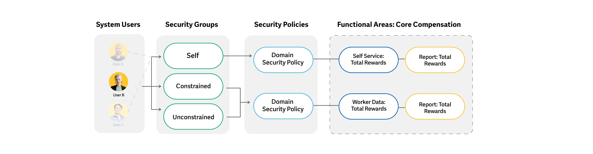
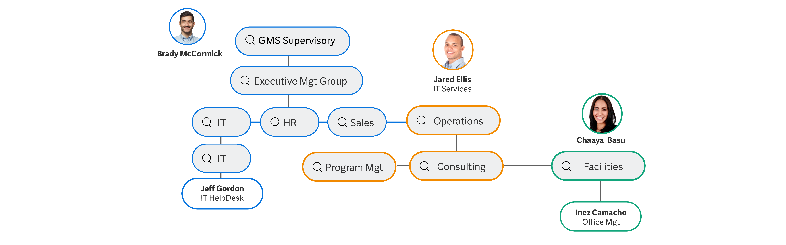
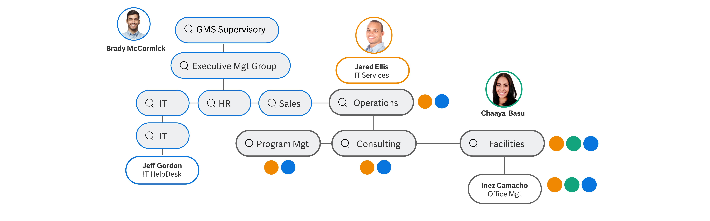

## Configurable security framework

### Function areas overview

The Workday configurable security framework enables your organization to control what a user can access and edit in Workday. The framework provides a tenant-wide model for access across Workday, from tasks, to reports, business processes, dashboards, and integrations. 

To access secured content, a user must have access to the domain or business process security policy that controls that content. Domains are collections of items that share the same security. A secured item may be in more than one domain. Business processes (or BPs) represent events or transactions in Workday. 

At the highest level, Workday functional areas control domains and business processes.

- Functional areas - Workday products consist of a series of functional areas. Examples include Staffing, Benefits, Core Compensation, Financial Accounting, and more.

- Domain and BP security policies - Workday determines the secured items within each domain. This can include tasks, delivered reports, report data sources, and web service operations.
	Business process types represent events or transactions in Workday. Workday determines the available business process types.

- Secured content - Individual data instances such as worker, social security numbers, emergency contact information, total compensation, etc. Some instances are secured to more than one domain.

### Functional area tasks and reports

Each Workday product contains functional areas. For example, Workday HCM controls the functional areas of benefits, recruiting, and time tracking. You can use the _Functional Areas_ report to find a full list in your tenant. You'll notice that some functional areas belong to more than one Workday product. This report lists all domains and business processes that each functional area controls.

You can't change which domains and business process types are in each functional area or which delivered items are in a domain. Instead, you'll create security groups and configure their membership. You can then configure domain and business process security policies to control which security groups can access each policy.

Before you can access a specific functional area, it must be enabled. As shown in the image below, use the _Maintain Functional Areas_ task to enable a functional area by selecting the Enabled checkbox. Similarly, you can clear the checkbox to disable a functional area.

### Security policies

When a user signs into a Workday tenant, their account is tied to many security groups. A user’s access is based on the configured permissions for each of those security groups. Each security group provides access to certain domains and business process security policies. Members of a security group can access the secured items in those policies, such as reports, tasks, or events.

**Security group access:**

1. System users - Individual users are added to security groups.

2. security groups - The security group type determines what kind of access a user has. You can tie access to a role (position) or directly to a specific user. You can constrain access in various ways, as well.

3. Security policies - Security groups can have either View or Modify access to specific domain security policies. For business process security policies, security groups have access to different steps in the process.

4. Functional areas - Examples include Staffing, Benefits, Core Compensation, Financial Accounting, and Procurement.
	- Domains - Secured content like:
		- Tasks
		- Data Sources
		- Report Fields
		- Reports
	- BP Types - Business process tasks include:
		- Initiation Steps
		- Action Steps
		- Approval Steps
		- View, Rescind, Cancel

Security policies:
- Access the "Domain security policies for functional areas" to inspect the security policies
- For business processes, you can add security groups to a business process security policy to grant access to the different business process types.

### Domain inheritance 

Some domains have a hierarchical relationship, with a parent domain and a child domain (or subdomain). Workday uses these parent-child relationships when common security access is likely.

- **Parent domains**
  
  From the _Domain Security Policies for Functional Area_ report, parent domains are indicated by a folder icon. By selecting this domain, it will expand to list the child domains. The parent security policy will have a status of Active.

- **Child domains**
  
  When you select a child domain, the status will alert you if it is inheriting permissions. This is indicated by the status of Active - inheriting parent permissions.

- **Override parent permissions**
  
  If the child policy requires different permissions, you can override the parent permissions. Select the Override Parent Permissions button to edit the security groups specified or to adjust their access to View vs. Modify permission.
 

### Activity notes

#### Task 1: update domain permissions

> Reference: https://wd5-media.myworkdaycdn.com/scorm/static/f/l32A/c/CDACF81BA11C83F5/BGLNBeFIAlfNoIBcTDjMiSJp89SKOHwC/extracted/scormcontent/index.html#/lessons/IA4YtrzjPeccjXKu508PMlDiJz4oVXiz

1. Sign in as Logan McNeil (_lmcneil_).
2. Run the **Domain Security Policies for Functional Area** report for the **Contact Information** functional area.
3. Select the **Person Data: Name** parent domain folder. Review the child domains contained within the parent domain folder.
4. Select the **Person Data: Preferred Name** child domain. Notice that it is inheriting parent permissions. 
5. Scroll down and select the **Override Parent Permissions** button. Then add **Employee as Self** to row with the View/Modify checkboxes selected.
6. Select **OK** and **Done**.
7. Select the **Person Data: Home Contact Information** parent domain and then the **Person Data: Social Networks** child domain. Notice that this domain has a status of Active and doesn’t inherit parent permissions.
8. Scroll down and select the **Use Parent Permissions** button.
9. Select the **Confirm** checkbox and then **OK**.
10. Run the **Activate Pending Security Policy Changes** task.
11. Enter a detailed comment that describes the security changes you made and select **OK**.
12. Select the **Confirm** checkbox and then **OK**.

### Security reports

The _View Security for Securable Item_ report determines how Workday secures a delivered item. Enter a minimum of three characters in the Securable Item report prompt. The report returns items matching the text string, grouped by securable item type. Select the View Security button to review the security policy for an item, including the permission required for the domain or business process type that controls the secured item. You will also find the security groups that are currently configured with access.

There may be instances where you need to know how a certain user has access to a securable item. For this, you can use the _Security Analysis for Securable Item and Account_ report.

> 💲 Tip:
> You can use the shortcut, "secura" in the Search box to bring up both reports.

### Security permissions

You can configure two levels of security group permissions in a domain security policy for reports and tasks - View permission and Modify permission.

- View permissions - Provides access only to domain items that require View permissions, such as report fields and data sources.
- Modify permissions - Provides access to the domain items that require Modify permissions, as well as the items requiring View permissions. Members of security groups with Modify permissions can edit securable items under those domains.

### GET vs PUT permissions

Integration permissions are different from report and task permissions. You can configure two levels of security group permissions in a domain security policy for integrations and other web service operations - get and put.

- GET - Provides access to extract data from Workday via a web service operation.
- PUT - Provides access to both extract data from Workday and load data into Workday via a web service operation.

For example, the Setup: Tax domain has both a Get Company Tax Details and a Put Company Tax Details web service.

Some domain actions and reporting items will show a permission of View Get. This permission indicates that security groups with Get permission can also access actions and reporting items requiring View permission, via integrations. An example would be the Find Tax Declaration Definitions report.

### Key takeaways

- Each functional area has domain and business process security polices that control access to secured content.

- Use the Domain Security Policies for Functional Area report to find a security policy's status, allowed security group types, and securable items.

- Child domains inherit permissions from a parent domain unless you break inheritance.

- Use secura reports to find the security behind a particular item, including whether it requires View or Modify permissions.

## Security groups

Controls access to content/s.

### Security group types

Security group types:
1. Self service - Workday-delivered access to a user’s own data. Examples: Employee as Self, Retiree as Self.
2. User-based - Manually assigned, unconstrained access for a specific user. Examples: HR Administrator, Finance Administrator.
3. Role-based - Membership derived from an assigned role. Access can be unconstrained, or constrained to organizations the role supports or leads. Examples: HR Partner, Manager.
4. Public - Workday-delivered access to public data. Examples: All Employees, All Retirees.
5. Segment-based - Derived based on included security groups and allows constrained access to segments of values. Example: A security group for sales and marketing managers to track travel expenses specific to sales and marketing.
6. Job-based - Membership derived from job criteria such as exempt jobs. Can be constrained or unconstrained. Example: Vice Presidents based on management level.

Three ways users become members of security groups:

1. Workday delivered
2. Manually assigned
3. Derived

Workday owns and automatically assigns some security groups. For example, when you create a Workday account for a new hire, Workday automatically assigns the Employee As Self and All Employees security groups to the account. These security groups allow the user to perform self-service tasks and access public information.

| Public                 | Self-Service              | Other             |
| ---------------------- | ------------------------- | ----------------- |
| All Users              | Employee As Self          | Implementers      |
| All Employees          | Pre-Employee As Self      | Initiator         |
| All Contingent Workers | Contingent Worker As Self | Manager’s Manager |
| All Project Members    | Project Member As Self    | Role Maintainer   |

Self-service security groups provide users with constrained access to only their own instance of data. Workday automatically assigns these security groups to workers in order to provide them with access to self-service tasks, such as Self-Service: Home Address.  
  
Public security groups provide users with access to public data appropriate for their employment status. Workday automatically assigns these security groups to workers in order to provide them with access that all members need. Worker Data: Public Worker Reports is an example of a domain security policy that public security groups have access to.

#### Workday delivered

Characteristics:
- Includes security group types:
	1. Self-service, 
	2. public, and other
- Constrained

- Workday delivered SGs are not configurable. 
- You cannot create, edit, or delete these security groups. But you can configure their access to security policies.

Examples of workday delivered SGs:
1. All employees
2. All contingent workers
3. Employee as self

#### Manually assigned

Characteristics:
- user based
	   - You can manually add or remove users from these security group types.
	   - Might apply to users such as: "payroll administrator" or "finance administrator"
- Unconstrained
- applies to integration systems
	- Constrained / unconstrained

#### Derived

Characteristics
- Role based
	- Constrained / Unconstrained
- Integration system
	- Constrained / Unconstrained
- Location membership
	- Unconstrained

- Most common derived SG type is role-based. 
	- For example, you might assign a user to the HR partner role. This would give them access to any security groups tied to that role.

**Notes:**
- Constrained access - only to their own instance of data, such as their contact information. Access to only a subset of data
- Unconstrained access - access to all instances of a securable item.

- User will be members of many security groups and their access will reflect the various security policy permissions granted by those security groups.

###  Configuring security groups

The majority of security groups are created during deployment. When you determine that your existing security groups do not provide the access needed, you will need to create a new security group. The most common security group types are Workday-delivered, User-Based, and Role-Based (Constrained). The details will vary depending on the security group type, but the overall process is the same.

**Scenario that might need configuration of new security group**: Brian Sullivan is going to serve as a Junior Compensation Administrator, which is not tied to a role. He needs unconstrained access to view five compensation-related worker data domains in the Core Compensation functional area.

Steps

Step 1: Confirm that no existing security group will serve your purpose
1. Navigate to the "new security group" report
2. search "compensation administrator"

Step 2: Identify a role of user for the new security group. If necessary, create a new assignable role
1. Go to user profile > access actionable actions > "view security group for user"
2. In the "view for security group restrictions" column, filter for unconstrained groups

Step 3: create a new security group with the appropriate security group type
1. navigate to the "create security group" task
2. select "user based" security group as the type. and assign a name
3. Enter "compensations administrator" on the "administered by security groups" field

Step 4: Assign a role to a specific position within an organization, or assign a user to the security group
1. search for "assign users to user-based security group" task
2. search for the name of the user based security group that was previously created.
3. then assign the target user and click "ok"

Step 5: Edit security permissions to include security group
1. search for "maintain permissions for security group" task
2. in the "source security group" field, select the security group that was created previously
3. add permissions by clicking on the plus icon ➕ and adding the desired permissions

Step 6: Activate pending security policy changes
1. search and access the "activate pending security policy changes" task
2. then enter a descriptive comment about the task to activate.
3. click on "ok" button and then tick the "confirm" checkbox and select "ok" again to activate the changes

Step 7: Test changes
1. search and navigate to "view security group" report
2. then enter the name of the previously created security group. and then check the members

### Security group maintenance

One of the primary challenges in maintaining your security configuration is handling staffing and organizational changes and the resulting impact on security. You'll regularly maintain role assignments and review security group membership. The following tips will help maintain your security configuration.

#### Configuration tips

- Use workday delivered security groups as much as possible
	- There may be a need for additional security groups but start with the defaults.

- Copy existing security group definitions to save time
	- If you do need to configure a new security group definition, try to find a similar group and copy their permissions as a starting point. Copying gives you a quick way to jump-start your configuration and base it on a group that you know is functioning properly.

- Create bread security groups for teams with similar reporting needs
	- You'll likely have many different teams requesting access to data that does not fit into any of the delivered security groups. In these cases, try to create a broad security group for similar reporting needs rather than separate security groups for each user or team that wants to run the reports. Think in terms of functions when deciding whether to combine or split out security groups. Consider including users from various teams on the same security group if they need the same functionality.

- Don't overuse user-based security groups
	- While user-based security groups are appropriate for administrative or configuration tasks and scheduled processes, role-based security groups are best for most other purposes. User-based security groups are unconstrained, so any given permissions are unrestricted and available across your tenant.

- Assign multiple security groups to users performing multiple actions.
	- Instead of attempting to merge security access into one large group, remember that you can assign two or more groups to the same user. If one person will perform multiple functions, add them to several security groups. You can then remain flexible for the future when you may not want one group to have the larger set of access permissions. 
	
	For example, if your HR Partner is also your Benefits Partner, do not create a new security group with combined access. Instead, just assign the HR Partner and Benefits Partner roles to the same position.

#### Naming conventions

To make maintenance as easy as possible, Workday recommends using naming conventions. When you combine naming conventions with the functional area, you can quickly identify the kind of data and level of access that each security group provides. Here is an example of a naming convention you might use:

| Naming Convention | Security Group Type      | Typical Access                                                     |
| ----------------- | ------------------------ | ------------------------------------------------------------------ |
| Partner           | Role-Based (Constrained) | View: Setup and Transactional Data   Modify: Transactional Data |
| Administrator     | User-Based               | View: Setup and Transactional Data   Modify: Transactional Data |
| Analyst           | Role-Based (Constrained) | View: Transactional Data                                           |
| Auditor           | User-Based               | View: Setup and Transactional Data                                 |

For example, if a security group is called HR Analyst, you can quickly tell that it provides view-only access to worker or transactional data.

#### Security group maintenance

When you need to make changes to a security group, use the following tasks that are secured to the Security Configuration domain:

- Edit Security Group: Editing a security group definition allows you to change the name of the security group and modify the configuration details. You can also inactivate used security groups that are no longer needed.

- Delete Security Group: Use this task to delete an unused security group. For instance, if you create a user-based security group and then quickly realize you should have created a role-based group. 

- Maintain Permissions for Security Group: Use this task to add or remove a security group from multiple domain security policies in one action. This task also allows you to copy the security policy permissions and user assignments from one security group to another. 

#### Maintaining permissions

The _Maintain Permissions for Security Group_ task allows permitted users to add or remove a security group from multiple domain security policies in one action. This task also allows you to copy the security policy permissions and user assignments (for user-based groups) from one security group to another. You can copy permissions to an existing security group of any type, or to a new security group of the same security group type. Select only the domain security policy permissions you want to include.

If the target security group is the same type as the source security group type, this task will copy all business process policy permissions. Note that the ability to select and clear business process permissions is not currently available.

### Security groups reports

#### Workday delivered security reports

Workday-delivered reports can help you answer security-related questions. To find a list of available delivered reports, run the _Workday Standard Reports_ delivered report. 

**Common delivered reports about security groups:**

- View security group
	- Details about a specific security group.

- View security groups
	- All security groups in the tenant.

- Action summary for security group
	- Security policies tied to a security group.

- Security analysis for security groups
	- Domains, reports, tasks, integrations, and business process types for a security group.

- Security analysis for workday account
	- A user’s cumulative access in the tenant.

- View security Groups for user
	- Security groups a user is a member of.

> ✨ **Tip:** Use the _View Security Group_ report to find members of a particular security group. This is useful when finding users for proxy testing. For unconstrained security groups, expand the Members menu. For role-based (constrained) security groups, select the assignable role.

**Notes:** 
- For viewing a user's security group, use the "View Security Groups for User" report.

## Security group constraints

### User based security

User-based security groups are the least restrictive security group type, providing members unconstrained access to items in permitted security policies. This security group type is appropriate for administrators or specific individuals who need system-wide access for their areas of responsibility. When you manually assign user-based security groups to a user, they stay with that user regardless of position or job changes, until manually removed. 

Examples of user-based security groups include:

- HR Administrator
- Payroll Administrator
- Finance Administrator
- Security Administrator
- Report Writer
- Auditor

> 📄 Note: Workday provides several default user-based security groups as a starting point.

#### Configuring user-based security

You can also create your own user-based security groups, as needed. Here are the overall steps for creating a security group when the type is used-based:

1. Determine that an existing security group won't serve your purpose.
2. Identify a user for the new security group. 
3. Create a new security group with the user-based security group type.
4. Assign a user to the security group.
5. Use the Maintain Permissions for Security Group task to edit security policy permissions.
6. Activate pending security policy changes.
7. Test the security changes.

#### Assigning user based security

If you are a member of a security group with access to the User-Based Security Group Administration domain, you can assign users to any user-based security group. Similarly, if you are a member of a security group included in the Administered by Security Groups field, you can assign members to that particular security group.

If authorized, you can assign users to user-based security groups in several ways:

- Run the Assign Users to User-Based Security Group task.
- Run the Assign User-Based Security Groups for Person task.
- From the security group’s Related Actions, select User-Based Security Group > Assign Users.
- From a user’s Related Actions,  select Security Profile > Assign User-Based Groups.
- Use the Put Assign User-Based Security Group web service to replace all users in the specified user-based security groups with the configured users.
- Use the Put User-Based Security Assignment web service to replace all user-based security groups for the specified users with the configured security groups.

Since user-based security groups follow the user, it's important to address user-based security group assignments in your staffing events when workers change jobs or leave the company.

> 📗 **Info**: To remove these security groups, you can use the Remove User-Based Security Groups service step.  
> You can also configure a To Do step to have someone review user-based security group assignments.

### Role based security

Role-based security groups are used frequently in Workday because they allow you to configure access for your support and leadership staff. A role-based security group will have one role assignment, but you can assign multiple roles to one user. 

Role-based security can be constrained or unconstrained. You can allow workers to access needed tasks, reports, and business process steps, but constrain them to just the organizations that they support or lead. An individual worker or target instance of data will be associated with multiple types of organizations, as each organization applies to different business functions.  For example, workers are hired into a supervisory organization, but can also be part of a company, cost center, region, or custom organization.

**Organizations:**

- Company
	- Global Modern Services, Inc. (USA) is an example of a company in your training tenant.
- Cost center
	- Examples of cost centers in your tenant are 41100 Benefits and 41200 Payroll.
- Region
	- Example regions include North America, Latin America, and EMEA.
- Custom organizations
	- Your tenant includes several custom organizations, such as Global Consulting Services, and Veterans.

Organizations are a very common way to enforce target constraints on members of a security group. For example, you can constrain members to only view data for workers in a given organization when running reports or tasks. 

Only role-based constrained security groups allow you to individually assign worker positions to a role for a specific organization that they are not in. An important benefit of the organization model is the ability to arrange organizations into parent-child hierarchies. Organization hierarchies ease reporting requirements and also allow you to enforce target access constraints by hierarchy level.

#### Constrained vs Unconstrained Access

Let’s examine an example of the difference between constrained and unconstrained access.

Brady McCormick is a member of the Employee As Self self-service security group with access to the _Total Rewards_ report. Due to the constraints of this type of security group, Brady can only run the report for his own instance of data. Brady cannot run the _Total Rewards_ report for other workers.

Brady's manager, Jared Ellis, is a member of the Manager role-based constrained security group as well as a member of the Employee As Self group. The Manager security group can access the _Worker Data: Total Reward_s domain, which gives Jared the ability to run the _Total Rewards_ report for his team, as well as for himself.

Logan McNeil is a member of an unconstrained security group, Compensation Administrator, as well as the Manager and Employee As Self security groups. Therefore, Logan can run the Total Rewards report for any worker because of her unconstrained access.

### Assignable roles

Role-based security groups use a concept called an assignable role (or "role") as the criteria for membership. A role represents the responsibilities a given assignee has for viewing, reporting, or managing data related to a role-enabled instance, such as for an organization. Each role-based security group can only reference one assignable role. However, you can have several role-based security groups for the same role, with different access rights for each security group.

For example, you can use the same Manager role in a number of role-based security groups to express that the user:

- Has access to information provided to all managers: Role-based unconstrained security group: Manager (Unconstrained).
- Has a direct relationship to the worker: Role-based constrained security group: Manager.
- Is in the organization chain for the worker: Role-based constrained security group: Management Chain.

Role-based security assigns permissions to the position the worker is in, rather than to the worker themselves. Workers become members of a role-based security group when someone assigns their position to the assignable role referenced in the security group definition. Tying the role assignment to the worker's position instead of to the worker, allows for easier maintenance. For instance, if a worker changes jobs or leaves the company, you can leave the role assignments on the unfilled position. That way, the worker who back-fills the position will assume those role assignments.

When you assign a role for an organization to a worker’s position or job, subordinate organizations without an existing role assignment typically inherit that assignment. Role assignees' target access depends on the security group configuration.

> 💡 Tip: Use the _Edit Tenant Setup – System_ task to configure the time zone setting for role assignments. You can use the assignee’s location or a tenant-configured default time zone as the time zone option. Once you select a time zone option, the effective time zone field will display in role assignment tasks and reports. If you do not configure time zone options in the tenant, you will not have the effective time zone field around role assignments. The system uses the Workday default Pacific time zone.

#### Method for assigning roles

Role assignments involve associating a worker’s position or job with a given assignable role for a given organization or role-enabled instance (e.g., project, fund, supplier contract).

You can assign roles in several ways:
1. At the organization or role-enabled instance level
2. At the worker position or job level
3. To an unfilled position
4. As a step in a business process
5. Via a web service through an integration

More on assigning roles:
- Assign roles to an organization
  
  From an organization’s Related Actions, select Roles > Assign Roles. Only members of the Role Maintainer security group can assign roles at the role-enabled instance or organization level. Users will only have access to roles they can assign.

- Assign roles to a worker's position or job
  
  To assign roles directly to a worker's position or job, navigate to their Related Actions, then select Security Profile > Assign Roles - Add/Remove. This option enables you to add roles, remove selected roles, remove all roles, and copy role assignments from another worker.

- Assign roles via integration
  
  Workday provides a web service operation for role assignments. Configure permitted security groups in the Assign Roles business process security policy to control who can access the web service operation.

### Configuring role based security

#### Access rights to organizations

For constrained role-based security groups, there are four options for configuring access rights to organizations.

- Current organization only
	- Constrains members to organizations where they have the role assignment. For example, a manager who has access to their direct reports’ information.

- Current organization and all subordinates
	- Constrains members to organizations and subordinate organizations, regardless of whether they have someone assigned to the role. For example, a manager’s supervisor can always approve time off requests, regardless of whether that position is filled or vacant.

- Current organization and unassigned subordinates
	- Constrains members to organizations where they have the role assignment and subordinate organizations that don’t have someone assigned to the role. For example, if a manager resigns, the manager’s supervisor can approve timecards for the manager’s staff.

- Current organization and subordinate level
	- Constrains members to organizations and subordinate organizations, down to a number of levels in the hierarchy. A director only has access to emergency contact information for managers who report to them and the managers’ direct reports (two levels in the hierarchy).

### Creating a role based security group

**Steps:**

Step 1: Confirm that no existing security group will serve your purpose
1. use "view security groups" report, use the role-based security group constraint
2. In the domains granted to security column, filter for workday accounts
3. confirm that existing security has no access to your target domain

Step 2: Identify a role for the new security group. If necessary, create a new assignable role.
1. navigate to the "maintain assignable roles" task and then add a row
2. name the new role and the populate the other information needed
3. for "signed/reviewed by security groups", select "security administrator"
4. then save the new role

Step 3: Create a new security group with the appropriate security group type.
1. We need to create role based constrained security group and add the new assignable role. To do this, navigate to the "create security group" task.
2. for "type of tenant security group" select role-based security group (constrained). and name the new security group
3. For assignable role, select the previously created role on step 2.
4. Verify the access rights to organization and to multiple job workers.

Step 4: Assign a role to a specific position within an organization
1. search and select "sup: Global modern service supervisory organization"
2. from the organization's related actions > select roles > then assign roles.
3. Add new row on the assigned roles table. select the role and assign to worker.
4. repeat steps 1-3 to add role to another worker

Step 5: Edit security policy permissions to include the security group.
1. Grant the created security group access to view and modify the workday accounts domain. To do this, navigate to `domain: workday accounts` 
2. on the domain's related actions > select domain > then "edit security policy permissions"
3. Add the created security group to the view and modify row along with other security groups
4. click OK to save changes

Step 6: Activate pending security policy changes
1. navigate to "activate pending security policy change" task.
2. enter descriptive comment and click ok -> tick the confirm checkbox and select ok again.

Step 7: Test the security changes
1. confirm that workers with assigned roles can run the reports that needs the created security group.
2. proxy as the worker -> run the "workday accounts" report
3. try to filter the names of other workers within the organization and outside the organization where the role as privilege to test the security changes.

### Assigning and modifying access rights

#### Part 1

The IT HelpDesk team has decided to add another IT Support Specialist, Chaaya Basu, to support the Facilities Group supervisory organization. In the organizational chart below, Chaaya Basu is assigned at the Facilities level, which reports up to Operations where Jared Ellis is assigned. This security group is currently configured as Applies to Current Organization and Unassigned Subordinates. Think about how this impacts security access, then answer the questions below.

❓Questions:
1. What are 2 ways you could assign the role immedietely?
	- From the Facilities Group supervisory organization’s Related Actions, select Roles > Assign Roles
		
	- From Chaaya Basu’s Related Actions, select Security Profile > Assign Roles - Add/Remove

2. After assigning the role to Chaaya, how would you test your changes?
	- Start Proxy to test that Chaaya can access Inez Camacho’s Workday account.
	- Start Proxy to test that Jeff Gordon can no longer access Inez Camacho’s Workday account.

3. Why does jeff gordon loose access to workday accounts for facilities?
	- The IT Specialists security group has access rights of Current Organization and Unassigned Subordinates. Because Chaaya is now assigned at the Facilities Group level, Jeff no longer has access.

### Part 2

The IT HelpDesk Manager decides that IT Support Specialists should be able to support Workday accounts for any worker in their current organization and all subordinate organizations, even if there is another IT Support Specialist assigned at a subordinate level. In the organizational chart below, notice this configuration impacts access. For example, Jared Ellis can access accounts for workers in Operations and any department that reports up to Operations.

❓Questions:
1. What access right should be the IT specialist security group have now?
	- Applies to Current Organization and All Subordinates. This provides access to organizations and subordinate organizations, regardless of whether or not someone is assigned to the role.

2. How do you make this change?
	- Use the Edit Security Group task and change the Access Rights to Organizations section.

### Key takeaways

- The _Assign Users to User-Based Security Groups_ task is one of several methods you can use to add members to a user-based security group.
    
- With Role-based (Constrained) security groups, you can allow workers to access needed tasks, reports, and business process steps, but only for the organizations they support or lead.
    
- Organizations are a very common way to enforce target constraints with parent-child hierarchies. Role-based (Constrained) security groups allow you to assign worker positions to a role for a specific organization, even if the worker is not in the organization.

