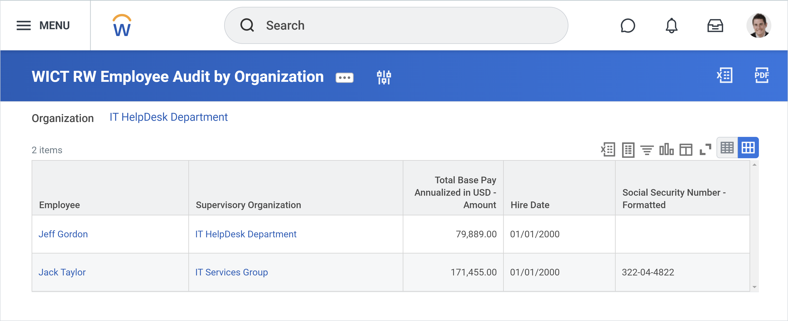

## Introduction to workday reporting

### Reports in workday

- we'll build reports using the "report writer" tool.
  - report-writer is built directly on workday and is not a third party integration

**Standard reports**

Workday delivers standard reports that are available for all customers. Standard reports are also called "Workday-delivered reports" or simply "delivered reports." If necessary, you can copy many of the Workday-delivered reports to create a custom report and modify it as needed.

> 📄 Report: Use the *Workday Standard Reports* report to view a full list of all Workday-delivered reports, regardless of whether you have security permissions to access each report.

Recall that in addition to standard reports, your tenant may have many custom reports. You can use the *All Custom Reports* report to view a full list of them.

#### Report types

1. Advanced:

   Advanced reports are one of the most common report types, and the report type we'll be practicing with in this course. With Advanced reports, you can list data fields as columns, in which Workday will render instances of the data as rows. You have a range of configuration options including sorting, filtering, grouping, and totalling data.

   The example above is the *Active Employees - Indexed* report, which is an advanced report that returns a list of employees (rows), organized in a series of fields (columns), such as Employee ID, Hire Date, and Email.

2. Matrix
   Matrix reports are also a common report type. They are similar to pivot tables and crosstabs in that you can group data by column or row and configure cells to display summary values where groupings intersect. You can drill down on matrix report output data for additional details, allowing you to perform custom analytics and interactive reporting across dimensions.

   This example, *Candidate Source Diversity Metrics*, groups job applications by recruiting source. It also summarizes the job applications by count and percent. Notice the output data is hyperlinked, unless the value is a zero. A user can select a data value to view additional details and perform additional analysis on that subset of data.

3. Composite
   Popular in financial reporting, this is the only report type that can accommodate multiple data sources in one report. To achieve this, the report can combine multiple "subreports," which can each have different data sources. This report type can also accommodate a unique range of formatting and styling options.

   This example, the *Actual vs Budget vs Prior Year* report, combines three data sources (having to do with journal lines, plan lines, and workers), to compare a wide range of finance data in one report. Additionally, composite reports often contain underlining and bold styling to assist with data presentation .

4. Transposed
   This report type is helpful for side-by-side comparisons. Essentially, the report swaps rows for columns.

   In this example, *Compare Team*, the columns (primary instances) are workers, and the rows are grouped into categories, including Job, Base Pay, and Bonus.

5. Search
   Search reports often begin with the word "find." You can use this report type to display instances of a business object that you can narrow down with facet filters or search terms.

   The *Find Candidates* report, as shown in the image above, lists all candidates for open positions in the system. You can use the report's Search bar at the top, or narrow down results from the facet filter menu on the left.

6. nBox
   The nBox report type allows you to group, summarize, and drill — similar to a matrix report. However, nBox reports have the added feature of displaying your results across defined horizontal and vertical "boxes." This can help you compare and visualize objects across two fields.

   Workday delivers a set of *Talent Matrix* nBox reports that map workers onto various combinations of talent-related fields, such as Performance and Base Pay, as shown in the image above.

7. Trending
   Trending reports allow you to group data by time period for trend analysis. They are similar to matrix reports, but the user is required to define a time series grouping for the report, such as quarter, year, or fiscal year.

   The *Average Total Compensation by Country and Quarter* report, shown here, organizes average total compensation across time, grouped by quarter.

### Workday reporting framework

Now that we have a high-level understanding of the reporting framework components, let's review some key terms that form the framework of a report in Workday.

#### Business Objects, Instances, and Fields

Workday stores data in business objects. A business object has fields and instances, which are similar to rows and columns in a spreadsheet. Each row is an instance, and each column represents an attribute or field related to that instance.

Example: Logan McNeil and Teresa Serrano are each an instance of the **Worker** business object. The **Worker** business object contains fields such as **Job Title**, **Age**, **Gender**, and **Dependents**.

|                |                               |         |            |                                       |
| -------------- | ----------------------------- | ------- | ---------- | ------------------------------------- |
| **Worker**     | **Job** **Title**             | **Age** | **Gender** | **Dependents**                        |
| Logan McNeil   | Chief Human Resources Officer | 47      | Female     | Megan McNeil  Pat McNeil           |
| Teresa Serrano | Chief Financial Officer       | 61      | Female     | Juan-Carlos Serrano  Pablo Serrano |

#### Primary business object

Every report will have a single **primary business object**. This is the main business object for the report.

The primary business object holds the data that displays in your report. It also determines what fields are initially available to include in the report.

#### Data source

When you create a report, you must select a **data source**, which will determine your primary business object.

Workday delivers data sources for some business objects. You can think of the data source as the "view" or "starting filter" for reporting on a given primary business object. It will determine exactly what info is available to report on.

Your report will display one row for each instance of your primary business object.

To understand these key terms better, let's think of them in a different way. When report writers design a report, they must answer the following questions:

- What do you want to report on?
- Which ones?
- What do you want to know about them?

Report writers answer these questions by choosing the primary business object, data source, and fields for the report. Select the Plus (+) icons in the image below to explore an example.

❓ Question: What does your data source selection determine for a report?
A: the primary-business-object and "the starting data set".

#### Related Business objects

Workday links **related business objects** (RBOs) together through certain fields. Related business objects enable you to access fields in a report that don’t belong to the primary business object.

For example: The Worker business object has a field called Dependents. Dependents is linked to the business object of Dependent. In a report with a primary business object of Worker, you can use the Dependents field to access the fields belonging to the Dependent business object. Select the Plus (+) icons in the image below to explore an example.

##### Business object details

The *Business Object Details* report can help you understand and navigate the Workday object model. When building reports, it's important to know how business objects relate to each other and which data sources are available.

> 💡 Tip: We recommend starting with the *Business Object Details* report first to get an idea of what objects you might use in your custom report.
>
> You can also use this report to get a list of data sources that use a certain business object.

When you run this report, it will first prompt you to select which business object you want to view details for. Then, the report displays up to four tabs: Fields, Related Business Objects, Data Sources, and Reports.

Select each tab below for a demonstration of the tabs that may appear on the *Business Object Details* report.

**Fields**

On the Fields tab, you can view all fields on the select business object. This report includes Workday-delivered, calculated, and custom field sources.

**Related business object**

🚧

**Data sources**

The Data Sources tab lists the data sources that are available for the select business object.

In this example, there are three data sources for the Expense Report business object:

- Expense Report for Printing Run
- Expense Reports for Company
- Expense Reports for Worker

**Reports**

The Reports tab lists standard and custom reports that use the select business object. Use these reports as a reference when writing reports for this business object.

At the bottom of the page, select the Reports Displaying Business Object at Second Level button to view reports that include this business object as a related object.

### Data sources

As you know, Workday is full of data. When you create a report, you will always be reporting on a subset of data in the system. There are several ways you can refine this subset of data so that your report is appropriately targeted.

The data source determines your starting dataset, and there are data source filters available on some data sources to narrow down that starting dataset. To further narrow down your data, you can add data filters to your report definition, which we'll learn about later.

#### Data sources and report output

Depending on the data source that a report uses, the report output appears differently. Play the video below for an in-depth comparison of two similar reports that use different data sources with different primary business objects.

> 💡Report: Use the *Data Sources* report to help you understand what primary business object is associated with which data source and which security groups are permitted to the data source.

Note:

- You can **copy and edit** report writer reports, but not xpresso reports.

### Key takeaways

- You can copy Report Writer standard reports, but not XpressO standard reports.

- The report data source determines which primary business object the report uses.

- Related business objects are objects that have an association with the primary business object. A field on the primary business object links the two business objects together.

- You can use the *Business Object Details* report to investigate business objects and their relationships to other business objects.

## Custom reports

### Creating reports

You can create a new report by using the Create Custom Report task, or by copying an existing report. You can copy standard or custom reports, so long as they are not Xpresso reports. There are two ways to copy a report:

1. use the "copy standard report to custom report" or
2. "Copy custom report task"

### Modifying report columns

When editing a report definition, you can modify the fields that display as columns in the report output via the Columns tab. Select the Plus (+) icons and Number icons in the image below for more details.

### Filtering

When editing a report definition, the Filter tab allows you to filter the report data based on fields on the primary business object. A filter consists of one or more filter conditions, which are defined in rows of the filter grid.

Fields that you use in filter conditions do not necessarily need to be on your columns grid on the Columns tab.

The example below is of a report filter on a report with a primary business object of Worker. The filter indicates that the report output should only show instances of Worker where Location=London (i.e. workers whose location is listed as London).

Select the Plus (+) icons in the image below to learn more about the options available when defining a filter.

Options when defining a filter

1. And/Or
   This field enables you to specify how multiple filter conditions should be evaluated.

   Selecting And indicates that each business object instance must satisfy all conditions in your filter criteria to display in the report.

   Selecting Or indicates that each business object instance must satisfy at least one of the conditions to display in the report.

2. Parentheses
   Some report types, like Advanced, allow you to use any combination of And and Or conditions within a filter.

   You can use parentheses to group conditions together and control the condition evaluation sequence.

3. Field
   This is the field from the primary business object to evaluate.

4. Operator
   This field specifies the logical operator in the filter condition. The available choices depend on the field type.

5. Comparison Type
   This field specifies how the system should compare the field. The options are: - **Value specified in this filter**: This option allows you to explicitly specify a value to filter on. - **Value from another field**: This option allows you to compare the value of one field to another. - **Prompt the user for the value**: With this option, the user-entered prompt value determines the report filter. - **Prompt the user for the value and ignore the filter condition if the value is blank**: This option configures an optional prompt. If the user enters nothing in the prompt (i.e., blank value), the report ignores the filter condition. The report only uses the value in the filter if it is not blank.
6. Comparison value
   This field specifies the value to compare to the Field value, or the user-selected prompt value. The ability to enable this field and available choices depends on the Field type, the Operator, and the Comparison Type.

Note:

- "Value specified in this filter" allows you to explicitly specify a value to filter on. Alex could configure this filter in a variety of ways, but here is one example:

  **Field**: Employee Type
  **Operator**: any in the selection list
  **Comparison** **Type**: Value specified in this filter
  **Comparison** **Value**: Regular

- You cannot perform filtering on a related business object, only the primary business object. You would need to configure filters on the subfilter tab to do this.

#### Subfiltering

In addition to filtering data from the primary business object, you can also filter data from related business objects.

On the Subfilter tab, you can specify fields from a related business object to use in filter conditions for the related data. You can use related business objects and fields in subfilters that do not appear on the report output.

### Prompting

Prompts, which allow users to specify the criteria for a report each time it runs, make reports more reusable and dynamic. Rather than hard coding filters and having multiple versions of a custom report, you can build one general report with prompts instead.

You can configure the prompt settings on the Prompts tab. Select each of the three tabs below to learn about the configuration options that appear at the top of the Prompts tab. Select the images to zoom in and out.

1. Instructions
   The Instructions field lets you specify information to display on the user prompt. Whoever runs the report will notice this text directly above the report prompt.

2. Populate undefined prompt defaults
   Some fields in Workday come with default prompts that will automatically appear on your report if you add the field to your report definition. The Populate Undefined Prompt Defaults checkbox lets you quickly populate any undefined prompts to the Prompt Defaults grid below so you can configure the prompt options.

3. Display prompt values in subtitle
   The Display Prompt Values in Subtitle checkbox lets you show or hide the prompt values at the top of the report output. In the Prompt Defaults grid, you can use the Do Not Include in Subtitle setting to exclude specific prompt values from displaying in the subtitle.

Below these fields is the Prompt Defaults grid, where you can specify options and default values for your prompt fields.

- Field
  Specifies the field for which you want to enter prompt data.

- Prompt Qualifier
  Normally, you will only use this field if you want to designate two date fields as "Starting Prompt" and "Ending Prompt" to create a prompted date range. Otherwise, the field will likely be blank or appear as "Default Prompt."

- label for Prompt
  Overrides the label for the prompt when you run the report.

- Default type
  Determines the default values to use when the report runs. The options are:

  - **No default value**: Specifies that there is no default value for the field. The prompt field will appear blank to the user at runtime.
  - **Specify default value**: Specifies that one or more default values in the Default Value field display to the user in the report prompt field.
  - **Determine default value at runtime**: Uses the value in the Default Value field to determine one or more default values to display in the report prompt field.

- Default value
  Specifies one or more default values or the field to use to determine the default prompt. This function goes with the Specify default value and Determine default value at runtime options.

- Required
  Requires the user to enter a prompt field value so the field cannot be blank when the report runs.

- Do not prompt at runtime
  Suppresses the display of the prompt at runtime so any user will not be able to view or use the prompt. Workday will use any default values automatically, skipping any interaction for the prompt for this field.

- Do not include in subtitle
  Suppresses the display of the prompt values from the final report output. Any values the user selects from prompts appear below the report title by default when the report runs.

Note:

- "Determine default value at runtime" allows you to configure dynamic prompt default values. Here is one example:

  - **Field**: Hire Date
  - **Default Type**: Determine value at runtime
  - **Default Value**: Today

#### Where else can prompts come from?

In addition to defining them in filters, prompts can be built into:

- **Data sources.**
  Example: When you use the Employees by Organization data source for a report, the following prompts will be built into the report definition: Include Managers, Include Subordinate Organizations, and Organization.

- **Data source filters.**
  Example: When you use the Journal Lines for Company data source filter (available on the Journal Lines data source) on a report, nine prompts will be built into the report definition, including Company, Year, and Period.

- **Field**
  Example: If you add the Expense Report Total Amount in Reporting Currency field to your report definition, there will be a built-in prompt for Reporting Currency.

### Key takeaways

- You can add fields from the primary business object and its related business objects to an advanced report.

- You can filter by fields on the primary business object and subfilter by fields on related business objects.

- You can use prompts in filters and subfilters.

- Prompts can come from a variety of sources like data sources, data source filters, and report fields.

- You can specify options and default values for prompt fields

## Dashboards

### Dashboard and worklet overview

A vital piece of Workday's reporting and analytics framework is dashboards. To understand how dashboards function, you must be familiar with worklets and how they differ from, and relate to, dashboards.

- A worklet is like a widget in the Workday interface that displays frequently referenced data and tasks common to a specific functional area. Workday delivers worklets typically found on the Home page, such as Pay or Benefits. Worklets on the Home page are also referred to as "applications." Workday can enable custom reports as worklets for use on landing pages and dashboards, allowing users quick access to key reports and analytics.

- Dashboards allow you to easily organize and deploy data to target audiences. You can configure Workday-delivered dashboards and custom dashboards to display groups of menus, announcements, and worklets.

#### Worklets

**Worklet configuration**

Workday displays worklets differently depending on where they appear.

> 📄 Note: You can enable custom reports as worklets and configure them on landing pages or dashboards. You can also enable advanced, matrix, nBox, transposed, trending, and composite report types as worklets.
>
> However, you cannot enable search and simple report types as worklets.

When viewing a report as a worklet, you can select the Configure icon to access various worklet options.

#### Dashboards

Dashboards consist of three parts: announcements, worklets, and menus. You can also organize worklets into tabs.

- Announcements deliver tailored messages, calls-to-action, and videos to workers.

  - Announcements deliver tailored messages, calls-to-action, and videos to workers. Announcements can include a message, image, video, and direct link to a task, custom report, or external site.

    You can also target certain worker populations using condition rules. For example, you could create a welcome announcement that is only visible to new employees. To create condition rules for announcements, use the Create Announcement Rule task.

- Worklets provide quick snapshots of important report data. You can copy and modify worklets as needed.
  Worklets provide quick snapshots of important report data. As an administrator, you can make worklets optional or required for certain worker populations.
  Workday-delivered dashboards include several relevant worklets, which you can copy and modify as needed. You can also configure custom reports as worklets, including Advanced, Composite, Matrix, nBox, Transposed, and Trending report types.

- Menus contain relevant tasks, reports, and external links, making it easier to take immediate action from a dashboard.

Tabs - Tabs let you further organize your dashboard content. A dashboard can have six tabs, and each tab can have up to six worklets.
While most Workday-delivered dashboards support tab functionality, certain Workday-delivered dashboards do not (e.g., Home, Onboarding, Learning, Org Studio, Inventory). Conversely, all custom dashboards are tab-enabled.

##### Landing pages

A landing page is another form of a dashboard. Landing pages display icons for easy access to other dashboards and worklets. These icons are called applications or apps.

The landing page that most workers will access is the Home page, shown here.

### Configuring dashboards and worklets

A custom report must be enabled as a worklet to be placed on a dashboard. You can enable a report as a worklet from the report definition.

#### Enable as worklet

From a report definition's Output tab, expand the Worklet Options section and select the Enable As Worklet checkbox. Then, in the Available on field, add the dashboards and landing pages that you want the worklet to be available on.

For example, in the image to the right, a custom report is enabled as a worklet and available on Home and My Dashboard.

There are several items to keep in mind when designing reports for use as a worklet.

- Prompts
  if a custom report prompts the user for a value, be sure to configure required prompt defaults when enabling the report as a worklet.  That way, the report output will display automatically when accessing the dashboard.

- Space
  Due to space restrictions, consider the amount of data output and number of fields configured. The system restricts worklets to display a maximum of 100 rows when appearing as a worklet on a landing page.

  Administrators often use charts (configured in the Output tab of a report definition) to visualize data and convey a lot of information in a small space. Additionally, sort sequence and filter criteria can help ensure only the essential data is output. A best practice is to start small, giving the user just enough information to determine if they need to select “View more… ” to display the maximized report.

  Optionally, you can configure a given field (report column) not to display when executed as a worklet. This option becomes available for reports enabled as worklets.

- Performance
  Design worklets to load in less than 30 seconds. Otherwise, they will not render on a landing page or dashboard. There are many factors that may negatively impact report performance (i.e., cause a report to take a long time to load), such as a high volume of instances returned and a large number of calculated fields used in the report definition.

#### User level configuration VS tenant configuration

Users can configure which worklets to display on landing pages and dashboards. Additionally, administrators can set the worklets as optional or required for authorized security groups at the tenant level.

**User level**

A user can manually configure worklets on a landing page or dashboard if:

- The user can access the dashboard and the worklet.
- The worklet is available on that dashboard.
- The worklet is not required.

**Tenant level**

As an administrator, you can also configure a dashboard’s worklets at the tenant level by using the Maintain Dashboards report. You still will need to have access to a worklet to configure it at the tenant level.

#### Configuring custom dashboards

You can create custom dashboards using the *Create Custom Dashboard* task, or by selecting the Create Custom Dashboard button from the *Maintain Dashboards* report, which will prompt you to specify the following:

- [ ] Domain
- [ ] Dashboard Icon
- [ ] Dashboard Tabs
- [ ] Maximum Worklets Allowed

- **Domains**

Secure custom dashboards to a delivered or custom domain. Users with security groups permitted for the domain can access the custom dashboard.
In this example the domain is Management Dashboard: Pay Cycle Command Center.

- **Dashboard icon**

Indicate which icon to display when you add the custom dashboard as a worklet on the Home page.
This example uses the Labor Cost Analysis Dashboard icon.

- **Dashboard tabs**

This checkbox indicates whether or not dashboard tabs are enabled for this dashboard.
In this example, tabs are enabled for the dashboard.

- **maximum worklets allowed**

Indicate the maximum number of worklets allowed on the dashboard. You can create up to six tabs in a dashboard, with up to six worklets per tab.
This example has six maximum worklets allowed.

---

After defining the dashboard settings, configure the dashboard tabs and content for the custom dashboard. Determine how many tabs you need, which worklets should be on the dashboard tabs, and which security groups should have access to each worklet.

#### Dashboard security

Workday secures dashboards to domains. A user must have a security group with permissions to the domain securing the landing page or dashboard in order to view the page.

From the Maintain Dashboards report, select Edit and access the Settings tab to determine the domain securing a given dashboard.

> ℹ️ Info: On the View Security for Securable Item report, delivered dashboards are labeled as (Report (XpressO)); and custom dashboards are labeled as (Custom Dashboard).

#### Worklet security

If a dashboard is selected on the Available On field on a custom report definition's worklet options, you can add or configure worklets on that dashboard. Once on a given landing page or dashboard, users can add worklets that they have access to.

- **Access to delivered worklets**

Workday secures delivered worklets to domains. In order to view or add a worklet to a dashboard, a user must have a security group with permissions to the domain securing the worklet.

- **Access to custom worklets**

Since these worklets are custom reports, the owner of the report must share the custom report with the user before the user can view the worklet.

If you share a custom report with a security group that has no security access to the dashboard, members of that security group can still run the report outside the dashboard. Similarly, security groups with access to the dashboard who do not have security access to the custom report can get to the dashboard but cannot view the configured worklet on that dashboard.

📃 Note:

- To view a worklet on a dashboard, a user must also belong to at least one security group on the Required for Groups field for the worklet in the dashboard definition. By default, this field will include all security groups that have access to the worklet, but an administrator can remove groups.

- _"A user must have a security group with permissions to the domain securing the landing page or dashboard in order to view the page. However, keep in mind that certain worklets will not be available on the dashboard if a user does not have access to view them."_

- If we didn't specify default values for required prompts, the worklet would appear on a dashboard with the warning message "Some worklet settings require more information." The user would have to manually configure the prompts before being able to view the report output on the dashboard.

- If you share a custom report with a security group that has no security access to the dashboard, members of that security group can still run the report outside the dashboard. However, they will still not be able to run the dashboard and therefore cannot view the report as a worklet on the dashboard.

##### Activity: Deploy a worklet on a custom dashboard

**Configure the worklet**

1. Select the Output tab.
1. Expand the Worklet Options section.
1. In the Available on field, add Cost Center Dashboard.

**Share the report definition**

1. Select the Share tab.
1. Select Share with specific authorized groups and users.
1. Add the following authorized groups: Chief Executive Officer, Chief Financial Officer, and Chief Human Resources Officer.
1. Select OK to save the report definition.

**Configure the dashboard**

1. Run the Maintain Dashboards report.
1. Filter for the Cost Center Dashboard and select Edit.
1. From the Content tab, select Add to add a dashboard tab.
1. In the Tab Name field, enter Headcount.
1. Expand the Worklets section.
1. Select the Add Row icon to add a row. In the Worklet column, select Headcount by Cost Center - Custom. The Required for Groups field automatically populates the groups you share the report with.
1. For the Worklet Size pull-down, select 2x.
1. Select Done.

**Test the dashboard**

1. Start Proxy as Steve Morgan (smorgan).
1. From the Menu, open Dashboards and select the Cost Center Dashboard.
1. Notice that Steve Morgan can access and view the dashboard. Steve can interact with the report or select View More... to run the report outside of the worklet.
1. Stop Proxy.

### Key takeaways

- Workday displays worklets as a "tile" (square) on dashboards and as a “bubble” (circle) on a landing page (i.e., Home and Workbench). You can enable custom reports as worklets and configure them on landing pages or dashboards.

- You can configure Workday-delivered dashboards and custom dashboards to display groups of custom reports enabled as worklets.

- Users can view a worklet on a dashboard if they have access to both the dashboard and the worklet. The worklet must also be configured to be available on the dashboard.

## Reporting security and administration

### Reporting security

Before getting into an example of reporting security, first check your understanding of the Workday security framework in general by answering the following question: "How does a user access a securable item?"

**A: A user belongs to a security group that has permissions to a domain security policy, which links to a domain that houses the securable item.**

- System users: Individual users are added to security groups.

- Security groups: The security group type determines what kind of access a user has. You can tie access to a role (position) or directly to a specific user. You can constrain access in various ways, as well.

- Security policies: Security groups can have either View or Modify access to specific domain security policies. For business process security policies, security groups have access to different steps in the process.

- Functional Areas: Examples include Staffing, Benefits, Core Compensation, Financial Accounting, and Procurement.

- Domains: Secured content like:

  - Tasks
  - Data Sources
  - Report Fields
  - Reports

- BP Types: Business process tasks include:
  - Initiation Steps
  - Action Steps
  - Approval Steps
  - View, Rescind, Cancel

**System user:**

In this example, the system user is Logan McNeil.

**Security group**

The HR Partner security group has one member, Logan McNeil. This security group identifies users with positions assigned to the HR Partner role.

**Domain security policy\***

The security group that Logan belongs to (HR Partner) has View/Modify permissions to the domain.

**Security domain**

The security domain that Logan has View/Modify permissions to is Worker Data: Active Employees.

**Securable items**

The security domain contains three securable items:

- Active Employees, a report.
- Employee Talent Analysis, another report.
- All Active Employees, a data source.

> In the example above, Logan can:
>
> - Run the Active Employees and Employee Talent Analysis reports.
> - Run a report that uses the All Active Employees data source.

##### What is the impact of access to a securable item?

You can use security domains and permitted security groups to control access to securable items such as reports, tasks, data sources, and report fields. Let's review some examples of securable items and what it means to have security access to them.

Be aware that the list of groups in the Permitted Security Groups column in the table below is not exhaustive.

| Securable Item                                 | Security Domain                                   | Permitted Security Groups                             | Impact                                                                                                                           |
| ---------------------------------------------- | ------------------------------------------------- | ----------------------------------------------------- | -------------------------------------------------------------------------------------------------------------------------------- |
| **Standard Report**: Find Journal Lines        | Process: Journals                                 | Accountant  Controller  Finance Auditor         | Members of these security groups can run this standard report.                                                                   |
| **Task**: Create Custom Report                 | Custom Report Creation                            | Report Writer  Manager  Implementers            | Members of these security groups can create custom reports.                                                                      |
| **Data Source**: All Customer-Owned Deductions | Set Up: Payroll (Calculations - Payroll Specific) | Payroll Admin  Payroll Auditor  Payroll Partner | Members of these security groups can create and run reports that use this data source (assuming the report is shared with them). |
| **Report Field**: Billing Schedule             | Process: Billing                                  | Accountant  Billing Specialist  Cash Manager    | Members of these security groups can access this report field and create reports with it.                                        |

#### Who can create, edit, and delete a custom report?

Users with access to the Custom Report Creation security domain can create a custom report. As you learned, security domains control access to data sources and report fields. When creating a custom report, you must have access to:

1. A security domain for the data source that you want to use.
1. Security domains for the report fields that you want to add.

> 📃 **Note:** The report owner and users with access to the Manage: All Custom Reports security domain can edit and delete a custom report. You cannot delete a custom report definition in use anywhere, such as a worklet on a dashboard.

### Sharing reports

Custom reports are not shared by default. A custom report is visible only to its owner (and to users who have access to manage all custom reports). The Share tab lets you share a custom report with authorized users. You can share a custom report with all users who have access to the report data source and data source filter. You can also share a report with specific groups and users who have access to the report data source and data source filter. The domain securing the custom report’s data source determines which security groups you can share the custom report with.

On the Share tab of a report definition, there are three options for sharing:

- Don't share report definition
	- By default, when you create a report, it is only visible to you. 

- Share with all authorized users
	- If you select Share with all authorized users, you will share a custom report with all users who have access to the report data source and data source filter.

- Share with specific authorized groups and users
	- If you select Share with specific authorized groups and users, you can designate who to share the report with, assuming they have access to the report data source and data source filter. You can designate a group of users (for example: managers), or individual users.

> 📃 Note: When you share a report, users can run the report, but they cannot edit it. Only the report owner—and those who can manage all custom reports—can edit custom reports.
> 
> However, a shared user can view the report definition and copy the report definition if the shared user is also a report writer.

A user must have access to these security domains to change the sharing options on a report:

- Domain: Report Definition Sharing - All Authorized Users 
- Domain: Report Definition Sharing - Specific Groups 
- Domain: Report Definition Sharing - Specific Users 

#### How does a shared report output appear to users?

A user running a shared report can view the report results based on their security access to the data source, data source filter, and report fields. The following example shows the report output when Jack Taylor runs a shared report. When Logan runs this report, her output contains more fields (columns) and has data in all instances.

### Transferring report ownership

Sometimes, you may need to transfer the ownership of reports, such as when employees change roles or leave the company. You can use the Transfer Ownership of Custom Reports task to change the owner of one or more reports to a different user. The new owner must have access to the report’s data source and report fields and have access to the Custom Report Creation security domain.

> Security note: You must have access to the Custom Report Administration or Manage: All Custom Reports security domain to transfer ownership of reports owned by other users.

#### Custom report exception audit

Run the Custom Report Exception Audit standard report to view warnings and errors for custom reports. This report is helpful when transferring ownership of a report to another user.

You can transfer a report to another user as long as the new owner has access to the data source. However, an error will appear if the new owner tries to edit the custom report without access to all of the report fields. Running this report can identify these errors ahead of time.

> Example: Logan McNeil transferred ownership of the Employee Audit by Organization custom report to Beth Liu. Because Beth has access to the data source, Logan is able to transfer ownership. However, Beth doesn't have access to the Emergency Contacts report field. When running the Custom Report Exception Audit report, a critical error appears for this report.

### Scheduling reports

While you can run a report to immediately view the output in Workday, you can also schedule a report to run using the Schedule a Report task. This generates an external output file, which is a snapshot of the data at runtime. You can find this task from the Search bar or from a report's Related Actions.

When scheduling a report, consider the following:

- You can schedule a report to run immediately, at a specific time in the future, or on a recurring basis. Scheduled reports run in the background.

- The output file can be Excel, PDF, or CSV files. Users can access output files from their Notifications, the My Reports menu, or by running the My Report Output Files report.

#### Sharing scheduled outputs

The Share tab of the Schedule a Report task allows you to share your scheduled output file with other users. This is different from sharing a report from the report definition, because you're sharing an output file.

The example in the image on the left shows a scheduled report output being shared with the Manager (Unconstrained) security group.

> 🔴 Important: By sharing a scheduled report output file, you are authorizing specified users to view the report data **exactly** as you view it, regardless of their Workday security.

**Analogy:**

You can think of scheduling reports as similar to printing a document from your computer. You may have sensitive information on your computer, which is protected by a password. Only you have access to that sensitive information, unless you choose to print it out.

Once you print, that information is now shared on a piece of paper at the printer. Let's say you choose a printer in the HR department—akin to sharing the report output with an HR-related security group—anyone with access to that printer can come by and pick it up.

#### Scheduling reports

Use the following reports to view future, present, and past background processes, including scheduled reports. 

- Scheduled future processes
	Use the Scheduled Future Processes report to view all background processes that are scheduled to run but have not yet done so. The report includes integrations, batch processes, and reports scheduled to run either once in the future or on a recurring basis. 

	Select Scheduled Future Process from the request name’s Related Actions to:

	- Edit or delete a scheduled request.
	- Suspend or activate a scheduled request.
	- Transfer ownership of a scheduled request (if someone leaves the company).

- Process monitor
	Run the *Process Monitor* report to view all background processes that are running or have run.

### Alerts

You can generate notifications outside of a business process using the Workday alerts framework.

Similar to business process notifications, you can send these alerts to your Workday notifications as well as to your email, depending on tenant setup. 

You can generate alerts using a custom report. This allows you to send out relevant business information based on any condition you'd create a report for in Workday. Some examples include:

- Key metrics reached or milestones met.
- Items overdue, like a project timesheet.
- Exceptions, like credit card transactions with no expense reports.
- Birthday and employment anniversary reminders to managers.
- Time off reminders to your team.

#### Configuring alerts

1. Crate custom report
	- Custom reports serve as the basis for alerts. The report's filter criteria defines the conditions for the alert.

2. Configure alert
	- Includes the recipients, message, and schedule.

3. Process Monitor
	- Shows the status of configured reports.

##### Alert example

A common use case for an alert is upcoming birthdays for a manager’s direct reports. Workday delivers a standard report that drives the delivered birthday alert.

**Step 1: Birthdays for this week and next report**

The birthday alert uses the _Alert -_ _Birthdays for this week and next_ report and executes once a week to notify the manager about a worker’s birthday.

| **Field**     | **Value**                                |
| ------------- | ---------------------------------------- |
| Report Name   | Alert - Birthdays for this week and next |
| Run Frequency | Weekly Recurrence                        |

**Step 2: Alert configuration tab**

Alert details display on the Alert Configuration tab.

The Recipients section shows which users and groups will receive the alert. The Subject and Body sections allow you to configure a custom message for the text of the alert.

In this case, the alert has introductory comments and populates the Details section with the worker name and birth date. Doing so allows the manager to easily determine whose birthday is coming up and the exact date. 

**Step 3: Schedule tab**

The Schedule tab indicates how often the process runs and the range of recurrence (specify a Start and End Date).

**Step 4: Additional info tab**

The Additional Info tab includes other information about the alert such as the creator of the alert and a list of scheduled launches.

### Key takeaways

- Security domains control access to standard reports, data sources, and report fields.

- Users running a shared report view report results based on their security.

- You can use the Transfer Ownership of Custom Reports task to change the owner of one or more reports to a different user.

- You can schedule a report to run immediately, at a specific time in the future, or on a recurring basis.

- By sharing a report output you specifically authorize the specified users to view the report and its data exactly as you view it, regardless of their Workday security. 

- You can generate alerts using a custom report, enabling relevant business information to send out based on any condition you've created a report for in Workday. 