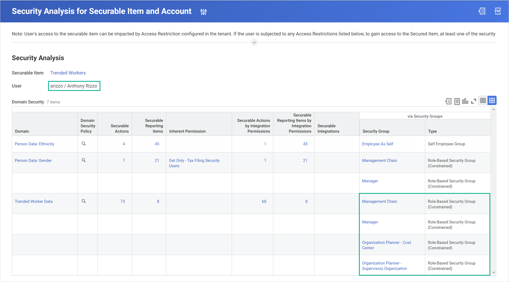
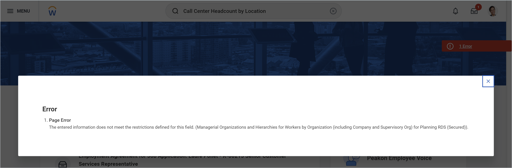

## Using calculated fields
### Overview of calculated fields

#### Where can you use calculated fields in workday?

You can use calculated fields in reporting, business processes, integrations, and when scheduling recurring processes.

- Reporting
  - You can add calculated fields to a custom report. For example, you can create a Date Difference calculated field to determine how far an employee’s performance review is overdue. You can also use calculated fields to create custom prompts or filters that affect the report output.

  Example: You can create a True/False Condition (Boolean) calculated field to display workers with a regular or full-time status and exclude contract workers.

- Business process: You can use calculated fields to control condition steps within a business process.
  Example: You can create a Text Length calculated field to determine how many letters are in a new hire’s name. You can then add a condition to the Hire business process generating a custom name tag if the new hire’s name is more than 20 characters.

- Integrations: Use calculated fields with connectors and in reports that collect data for document transformation. You can also use calculated fields in an integration using Workday Enterprise Interface Builder (EIB).
  Example: You can use a Format Text calculated field to format employee first names to uppercase. Doing so aligns with the needs of the external system in the integration.

- Scheduling recurring processes: You can use calculated fields to determine dynamic runtime parameters for recurring scheduled processes.
  Example: You can run a specific report for each day (from two months ago through today) using an Increment or Decrement Date calculated field. This calculated field function establishes the date parameters.

**There are three primary characteristics of calculated fields:**

1. Existing data within the Workday tenant is the basis for calculated fields.
  
  Workday calculates the value of the field based on existing data, which can include Workday-delivered fields, other calculated fields, or available custom fields.

2. All calculated fields resolve at runtime.
  Calculated field values are not stored in the tenant. Rather, Workday determines the value of a calculated field at runtime, so that it captures real-time data.

4. Workday associates calculated fields with a business object. 
  The business object determines what data you can use in a calculated field definition and where you can use the calculated field.

#### Recognizing calculated fields in workday

Any calculated fields you create for a business object appear and behave just like any other Workday-delivered field for that business object.

To determine if you’re working with a calculated field, you can view the field’s Related Actions. The title of the field will review whether it is a calculated field and if so, what type. 

There are two types of calculated fields: system-wide and report-specific.

1. System wide

  System-wide calculated fields are:

    - Available throughout Workday, not just in reports.
    - Available to all authorized users.
    - Accessible through the Maintain Calculated Fields report.

  **Tip: You can convert system-wide calculated fields to report-specific using the Convert Calculated Field task.**

2. Report specific

  Report-specific calculated fields:
    - Reduce the clutter associated with system-wide calculated fields, when only used by a single report or integration.
    - Allow you to define calculations without having to coordinate with others.

  **Tip: You can convert report-specific calculated fields to system-wide using the Convert Calculated Field for Report task.**

#### Calculated field functions

Calculated fields can be date, numeric, currency, text, Boolean (true/false), single-instance, and multi-instance. The system determines the possible field types to return depending on the type of function.

> Tip: It's helpful to know that there is a breadth of options available, and that calculated fields can vary in field type returned. You do not need to memorize every type of calculated field.

Field type returned:

- Numeric
  1. Arithmetic Calculation
  1. Convert Currency
  1. Convert Text to Number
  1. Count Related Instances
  1. Date Difference
  1. Numeric Constant
  1. Sum Related Instances
  1. Text Length

- Text
  1. Concatenate Text
  1. Lookup Translated Value
  1. Substring Text
  1. Text Constant
  1. Format Date
  1. Format Number
  1. Format Text

- Organizations
  1. Lookup Organization
  1. Lookup Organization Roles
  1. Lookup Hierarchy
  1. Lookup Hierarchy Rollup

- Date
  1. Build Date
  1. Date Constant
  1. Increment Decrement Date

- Boolean: True/false condition

- Instance
  1. Aggregate Related Instance
  1. Evaluate Expression Band
  1. Extract Multi-Instance
  1. Extract Single Instance
  1. Lookup Date Rollup
  1. Lookup Range Band

**Functions:**
The following functions can return any of the previous formats:

1. Evaluate Expression
1. Lookup Related Value
1. Lookup Value as of Date
1. Prompt for Value
1. Lookup Field with Prompts

### Creating and maintaining calculated fields

#### Creating calculated fields

step 1: Run the create calculated field task
  From the Create Calculated Field task:
  1. Name your field.
  1. Select the business object to associate your field with.
  1. Choose a function type.

Step 2: Configure the calculation tab
  From the second page of the task, specify the parameters.
  Note: This tab will vary depending on your function type.

Step 3: Configure the additional info tab
  On the Additional Info tab:
  1. Write a description for your field.
  1. Specify a category for the field.

> 💡 Tip: For efficiency, you can also use an existing calculated field's Related Actions to copy the calculated field using the same business object and function as the original.

#### Who can create calculated fields?

Unlike report definitions, calculated fields do not have ownership. Rather, a user's domain security access determines whether they can create a calculate field, and if so, what type. 

#### Who can access calculated fields?

You do not need to configure security for a calculated field. Access to a calculated field depends on the security of the underlying secured fields that the calculation uses. Scroll down to learn more.

**Access to secured items:**

Recall that Workday-delivered report fields and custom fields are secured items in security domains. Users with access to these secured items can access calculated fields that use these items in reports. In other words, authorized access to all fields in the calculation will allow you to add the calculated field to your report.

Security access to a calculated field definition is, therefore, derived from its underlying secured fields.

> Note: Even though you may have access to the underlying field and the data source, role-based constrained access—for example, manager access to their workers' data—may still prevent a person running the report from viewing data in the output.

**View security access**

You can view the security for a calculated field to examine the underlying secured fields and configured security. You can also view the underlying domains and domain security policies.

From a calculated field's Related Actions, select *View Security Groups* or *View Security*.

#### Maintaining calculated fields 

You can use the Maintain Calculated Fields report as a control center for managing system-wide calculated fields.

- Business object: The report is organized by business object. Filter this column to narrow down the business objects that you want to view.

- Field:  You can access the field's Related Actions directly from this column. This is useful when you want to copy the field or check security requirements.
  You can also select the field name to navigate to the field's definition.

- Field Type: Recall that calculated fields can return a range of field types, such as date, text, boolean,  single-instance, and multi-instance.

- Function: This field refers to the function that the calculated field uses, such as Lookup Related Value or True/False. There can only be one function per calculated field.

- Edit: Select this button to edit the calculated field. Alternatively, you can use the field's Related Actions and select Calculated Field > Edit.

- Delete: Select this button to delete the calculated field. Alternatively, from the field's Related Actions, select Calculated Field > Delete.

  You cannot delete calculated fields that are already in use, such as in a custom report. To delete a field in use, you must first remove all references within Workday for that calculated field. View the Where Used tab in the calculated field definition to view where those references exist.

You can also run the following tasks directly from the Search box to edit, create, and delete calculated fields:

- Create Calculated Field
- Edit Calculated Field
- Delete Calculated Field

To explore calculated fields on your tenant, use the following reports.

- All calculated reports
  To view all calculated fields in the tenant, run the All Calculated Fields report. Selecting the "Include Report Specific Calculated Fields" checkbox in the report output includes system-wide and report-specific fields. 

- Report fields
  To view all fields in the tenant—including Workday-delivered and calculated fields—run the Report Fields report. When you run the report, you will be prompted to designate a business object. 

> 💲 Tip: Use the `cf:` prefix in the Search box to locate a calculated field by name.

### Key takeaways

- Calculated fields allow you to put data where you want it, how you want it.
- Calculated fields are associated with a business object.
- Calculated fields resolve at runtime and do not hold a value.
- Access to calculated fields depends on the security of the underlying secured fields used in the calculation.

## Testing reports

### Report testing tools

Testing reports usually involves running a report or dashboard as a user and verifying that the data appears how it should. As you are testing, think about report security and how it can impact the output of a report. It is also helpful to understand the expected behavior of the report, and the report definition, if possible. 

- "Can the user access the report?"
    If a user searches for the report title and the report is not returned as a search result, the user does not have access to the report. 

- "Are there any fields missing from the output?"
    Remember that if a user does not have access to a report field, it will not appear on the report output. This can be easy to miss when you're testing, as the user can run the report without any alerts or errors. Be sure you understand which fields should appear as expected behavior. 

- "Is there any data missing from the output?"
    Remember that constrained access to data can affect the data that appears in a user's output. Pay attention to the data and, if possible, compare data outputs between users to test that the constrained access is having the expected effect on the report output. 

### Activity notes

##### Activity: test a custom report

**Task 1: Choose a member of the security group**
    1. Sign in as Logan McNeil (lmcneil).
    1. Run the View Security Group report for the Manager security group. 
    1. Select the Manager assignable role to view the members.
    1. Sign in or start proxy as one of the members, for example, Helen Meyer or Beth Liu.

**Task 2: Verify direct reports**
    1. To verify which workers your chosen manager should be able to view in the report output, select the manager's profile icon > View Profile.
    1. Select the Team button.
    1. Alternatively, there are many reports that show a manager's direct reports, such as My Team Members.

**Task 3: Run the report**
    1. In the Search box, search for employees potential.
    1. Select the Employees Potential report to run the report and examine the output.
    1. Optionally, proxy in as another manager and repeat tasks 2-3 to double-check results.

##### Activity: test a dashboard

**Task 1: Choose a member of the security group**
    1. Sign in as Logan McNeil (lmcneil).
    1. Run the View Security Group report for the Recruiter security group. 
    1. Select the Recruiter assignable role to view those assigned. 
    1. Sign in or start proxy as Carmen Cortes, James Moore, Jacqueline Desjardins, or Johannes Koch. 

**Task 2: Run the dashboard**
    1. From the Home page, search for Recruiting Talent Search.
    1. Select the Recruiting Talent Search dashboard.
    1. Notice that the Compare Workers in Succession Pool worklet does not appear. Also, if you proxied in as James Moore, Jacqueline Desjardins, or Johannes Koch, you will notice data missing for one or more worklets.

### Key takeaways

- Report and dashboard outputs may appear differently for different users. It is important to be clear on the expected result of a user running a report or dashboard.
- When data instances are missing in a report output, it might also be due to missing data in Workday. However, it might be due to a user's constrained data to that report field.

## Troubleshooting report issues

### Report troubleshooting

When someone comes to you with reporting issues, here are a few steps you can take to determine the root cause:

1. Determine which domains secure the standard report, data source, or report fields and the permitted security groups. Remember that report fields can be columns on the report, but can also appear in prompts and filters.
1. Compare the user's security access to the items above. 
1. Review the report definition. Are there any prompts or filters that are altering the output in a way the user is not aware of? 
1. If you can, test the report as another user or in another environment and note any changes in the report output.

#### Common access issues and root causes

The following table shows common report access issues that users face when running a shared report. Keep these in mind as you are troubleshooting reports. 

- A user cannot run a standard report
    - The user does not have access to the domain securing the standard report.

- A user cannot run a custom report
    - The custom report is not shared with the user.

- Report data field for certain instances does not display
    - The data is missing for these instances or the user belongs to a security group that has constrained access to the report field.

- A report field does not display at all
    - The user does not belong to a security group that has access to the report field.

- Different number of rows displaying for different users
    - The users belong to a security group that has constrained access to the data source or to report fields used in filters.

- A user gets an access error when running a report
    - The user does not belong to a security group that has access to a report field used to generate the report, such as in a filter or subfilter.

### Activity notes

#### Activity 1: troubleshoot a dashboard

**Hint 1:**

Rule out any security access issues. Remember that custom worklets are custom reports, and a user must have proper access to the report in order to view the worklet.

**Hint 2:**

Use the Maintain Dashboards report to view the dashboard configuration.

**Hint 3:**

Edit the dashboard and expand the Worklets section to identify the issue with the worklet.

#### Activity 2: analyze difference in two report outputs

**Hint 1:**

Run the report as each user to understand the difference in output. 

**Hint 2:**

Check Anthony and Logan's security on the data source by selecting its Related Actions > Security > Security Analysis for Securable Item and Account.

#### Checking your work

From the Headcount by Year report definition, select the data source's Related Actions. Then, select Security > Security Analysis for Securable Item and Account. As shown in the image below, Anthony Rizzo only has constrained access to the Trended Worker Data domain, which secures the Trended Worker data source. 

On the other hand, as shown in the image below, Logan McNeil is a member of HR Administrator, which is a user-based security group. User-based security groups have unconstrained access, meaning Logan can view all trended worker data. This explains why Logan has more rows in her report output. 

#### Activity 3: Determine the root cause of a runtime error

Business case:

Julie Boyer has informed Logan that she can't run a report. When she attempts to access it from the Search box, she receives the error message: The entered information does not meet the restrictions defined for this field (Managerial Organizations and Hierarchies for Workers by Organization (including Company and Supervisory Org) for Planning RDS (Secured).

As Logan, find the cause of the issue and propose a solution.

Although there are several ways to find the cause of the issue and solve for it, in the following simulation, you'll follow these steps:

1. Check user's security access to data source filter
2. Review user's security group access
3. Compare user's security access to report definition
4. Proposed solution

### Key takeaways

- When troubleshooting, check a user's security access to a report's data source, data source filters, and report fields. 
- After checking security access, explore a report or dashboard's definition. Often, that is where you will be able to catch root issues. 
- If you can, test a report or dashboard as another user. This can help you narrow down the root cause, especially if it has to do with security access. 
