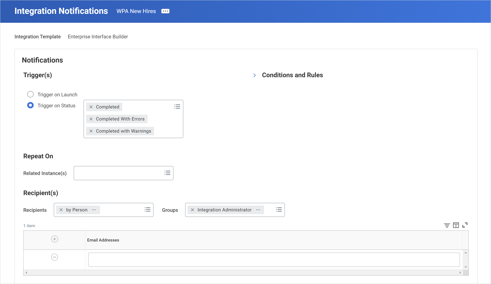

## Introduction to integration  systems

### Integrations in workday

"Integration get data in and out of workday"

- Integration system - the definition of an integration between workday and an external system.
- Integration event - the act of running an integration.
- Launch - triggers the integration event.

Web service - is like the instructions portion of your recipe. It defines what integration should do with your data. The specific web service an integration uses is defined in the integration system.

### Web services

The internet provides connectivity for many computers belonging to many different networks. A web service is a standardized method for processing messages between client and server applications.

All Workday transactions happen because of web services. In a web service transaction, a user or system sends a request. A server processes the request and sends back a response.

#### Web services directory

In the Workday Community, you can access the Workday Web Services Directory. This resource provides information on web service operations that you can use for integrations.

#### Integration tools

To build an integration system, you use an integration tool. Workday delivers four integration tools, allowing you to configure integration systems for different use cases.

- EIB
    - Most common tool
    - Simple inbound and outbound data transfer
    - Inbound EIBs work well for one-time bulk data loads.
    - Inbound EIBs use editable spreadsheets to upload data.
    - Outbound EIBs can use Workday custom reports (RaaS) for simple data export

- Cloud connect 
    - More configurable than EIBs
    - Prebuilt integration templates
    - Often the best solution when there is no integration template for your endpoint

- DT (Document transformation integration connector)
    - Work with connectors to modify data formats
    - Have basic error message functionality
    - Use same source as connector (extract rather than transform data)

- Workday studio
    - Build, own and support sophisticated integrations
    - separate eclipse-based development environment
    - Launch integrations from studio or workday

**Two way data flow**

Workday integrations support two-way data exchange between Workday and an external endpoint.

- Outbound integrations
    - Workday provides the data.
    - You can perform transformations on the outgoing data.
    - For example, you can retrieve payroll data from Workday, process the data, and deliver the data to an external system, like a third-party payroll provider.

- Inbound integrations
    - You import data into Workday.
    - For example, you can retrieve employee, payroll, or budget data from an external system, process the data, and import the data into Workday.

### Key takeaways

- Workday integrations support two-way data exchange between Workday and an external endpoint.
- An integration system is a definition of an integration between Workday and an external system. The integration system provides the methodology for communicating data. 
- A web service is a standardized method for processing messages between client and server applications.
- To build an integration system, you use an integration tool. Workday offers four integration tools, with the simplest tool being the Enterprise Interface Builder (EIB).

## Inbound EIBS

### Introduction to inbound EIBs

❓ What is an inbound EIB?

Recall that Enterprise Interface Builder (EIB) is one of the four integration tools that you can use in Workday.

Inbound EIBs allow you to load large quantities of data into Workday that you would otherwise need to manually enter one item at a time.

> Example: An inbound EIB allows you to hire and provide data for multiple employees at once, instead of manually hiring one at a time in Workday using the Hire Employee task. 

So, when should you use an inbound EIB? You should use one if:
    - One inbound file includes all the necessary data.
    - You only need to invoke one web service.
    - You can manually upload the file.
    - Your external file is smaller than one gigabyte, or you can separate the file into several smaller files.

For most inbound EIBs, you need to configure two components:
    1. An inbound EIB integration system.
    1. A spreadsheet template.

> ⚠️ Important: Some inbound EIBs use external files or URLs instead of Workday spreadsheet templates. However, inbound EIBs from spreadsheet templates are the most common.

#### Create EIB task

1. General settings
    This is where you will enter the name, ID, and description for the EIB.

2. Get  data
    This is where you define how Workday will get the data for the integration. You can attach a file of data or designate a location from which Workday can get the data, such as Amazon Simple Storage or Google Drive.
    This is also where you select the web service you'd like to use. 

3. Transform
    This is where you define how Workday should transform the data after retrieval. With simple EIBs, you won't have to spend much time on this tab.

4. Deliver
    This is where you define where Workday should put the data. 

### Spreadsheet template model

To load data into Workday using Workday Web Services, Workday provides template models and corresponding spreadsheet templates. The template model represents the data columns associated with a particular Workday Web Service definition. Each spreadsheet template is based on a template model that defines the column information for an upload. 

To simplify data entry and streamline the upload process, you can edit the template model. Examples include:

- Overriding column values.
- Providing labels and cell comments.
- Reordering worksheets.
- Hiding unwanted items.

#### View template model

Let's use the View Template Model report to review the template model for the Hire Employee web service. 

- Based on a web service
    Workday creates a template model for EIBs based on the selected web service.
    In this example, the web service is Hire Employee.

- Template versions
    There can be multiple versions of a spreadsheet template for different users. For each version, there will be a separate EIB integration system.

- Template model patterns
    This determines the structure of the spreadsheet. This template model follows the business process pattern, meaning the spreadsheet will have separate sheets for the main business process and any subprocesses.

- Processes
    - Each folder in the template model will correspond to a sheet in the spreadsheet template, which also corresponds to the business process or subprocess involved in the integration.
    - In this example, Hire Employee is the main business process and will have its own sheet in the spreadsheet template. Any subprocesses—such as Propose Compensation for Hire and Assign Pay Group—will have their own sheets as well.

- Template model area
    - There are template model areas listed in each folder. Each template model area will correspond to a group of columns in the spreadsheet template.
    - This example shows the Applicant Data template model area.

##### Template model patterns

Template models use patterns to determine the spreadsheet template’s structure. There are three template model patterns.

1. Business process
    Triggers business processes.

2. Web service background process
    Inputs and modifies data using Import web services.

3. Data load
    Inputs and modifies data in Workday.

##### Editing template models

When working with spreadsheet templates, you may be asked to modify the sheets, areas, and columns of the template model to meet business requirements. 

1. Create the inbound EIB

    Use the Create EIB task to create an inbound EIB.

2. Generate the spreadsheet template
    1. From the integration's Related Actions, navigate to the Template Model menu and select Generate Spreadsheet Template.
    1. Choose XML or XLSX format.
    1. Select the Confirm checkbox.
    1. Refresh the process until it completes.

3. Review the spreadsheet template 

    Identify any changes you want to make. For example:
    - Review the overall structure of the spreadsheet, including the individual sheets and sheet areas.
    - Review the column groupings in each area to understand the relationships between fields.
    - Notice the required, conditionally required, and optional fields.
    - View comments by hovering your mouse over spreadsheet cells.

4. Edit the template model

    Select the template model object to view it. Then, select either Edit Template Model Area or Edit Template Model Sheet. Consider the following:
    - If editing a template area, you can rename the areas, add Excel cell comments, or hide areas.
    - If editing a template sheet, you can reorder and rename tabs, rename sheets, or hide sheets.
    - Ensure that the reference ID type meets your needs.

5. Repeat steps 2-4

    If you made any changes, generate the spreadsheet template again, view the template, and then edit the template model until the spreadsheet template meets your needs.

    > Important: Each time you edit the template model, you must generate the spreadsheet template to create a new spreadsheet that matches the updated model. If they do not match, the EIB will not successfully complete.

##### Template model columns

In addition to editing template model areas and sheets, you can modify spreadsheet columns.

From a template model area, select the column's Related Actions and then Template Model Column > Edit Details. From here, you can:
Rename columns.

- Change area labels.
- Override certain values.
- Select reference ID types.
- Edit Microsoft Excel comments.
- Hide columns.
- Maintain values for columns that accept multiple entries.
- Limit a field to only display valid values.

##### Generate spreadsheet template task

To enter or modify data for an inbound EIB, you need to generate a spreadsheet template. In most cases, this creates a blank spreadsheet template (based on the template model) where you input all data to upload back into Workday. However, some web service operations enable you to generate a spreadsheet with automatically populated data, like job profile data.

You generate a spreadsheet template using the Generate Spreadsheet Template task, which you access from an EIB's Related Actions. From the Template Model menu option, select either Generate Spreadsheet Template or Generate Spreadsheet Template with Data.

- **Generate Spreadsheet Template:** Generate a blank spreadsheet, in either XML or XLSX format.
- **Generate Spreadsheet Template with Data:** Generate a spreadsheet with prepopulated data, in either XML or XLSX format.

> 💲Tip: You can generate spreadsheets in XML and XLSX formats, both of which you can open and modify in Microsoft Excel. Files in XLSX format are 50-60 percent smaller, so Workday recommends using XLSX files.

### Populating spreadsheet templates

Once you have generated a spreadsheet template, you'll populate it with data. Inbound EIB spreadsheet templates from web services share some common structures and rules for data entry. In this lesson, you'll learn about:

- The structure of a spreadsheet template.
- Loading multiple values.
- Replacing and deleting existing data.

#### Spreadsheet template structure

First, let's explore the structure of a spreadsheet template. While each spreadsheet differs depending on the type of data being imported, there are two types of sheets in each template:

- Main Sheet: The first sheet typically provides an overview of the data and high-level instructions for importing the data into Workday.
- Data Sheets: Any subsequent sheets provide space to enter data that will be imported into Workday.

##### Main sheet

Overview Sheet: The first sheet in the spreadsheet template for many EIBs—in this example, the Create Position EIB—which contains a description of the EIB and instructions for running the business processes triggered by the EIB.

Import Web Service Sheet: The first sheet for Import web service EIBs—in this case, the Import Payroll Input EIB—which contains header keys and other information Workday uses to successfully import data. The sheet's title is the web service, like Import Payroll Input.

#### Processing instructions on the overview sheet

On the Overview sheet of spreadsheet templates with a business process pattern, you can specify how you want the business process to run with the following processing instructions:

- Manual processing

    Triggers Review and Approval steps in the process and includes all To Do steps and notifications.

- Automatic processing

    Automatically completes steps in the process, including Approval, To Do, and Document Review tasks, and bypasses notifications. This option is not available for all business processes. You must enter all required data, if selected.

- Skip processing when step is marked optional

    Bypasses subprocesses that you mark as optional or do not include in your business process definition. You cannot skip the main process. If you skip a subprocess, do not enter any data in its corresponding sheet. 

    The table below shows an example of processing instructions on the Overview sheet for the Create Position EIB. This spreadsheet template would create positions and assign organizations, but would skip the additional subprocesses in the EIB.

    |                              |                                              |
    | ---------------------------- | -------------------------------------------- |
    | **Business Process**         | **Processing Instruction**                   |
    | Create Position              | Automatic Processing                         |
    | Edit Assign Organization     | Automatic Processing                         |
    | Request Default Compensation | Skip Processing when Step is marked Optional |
    | Assign Pay Group             | Skip Processing when Step is marked Optional |
    | Assign Costing Allocation    | Skip Processing when Step is marked Optional |

- Run now

    Immediately triggers the process with manual processing, so the business process may complete before the EIB does. This option is often used when chaining together multiple EIBs or EIB and Workday Studio integration systems.

- Run now with Automatic Processing

    Immediately triggers the process with automatic processing, so the business process may complete before the EIB does. This option is often used when chaining together multiple EIBs or EIB and Workday Studio integration systems.

#### Load multiple values

Sometimes, you'll need to enter multiple values to populate a multi-select field in Workday. To do so, add rows immediately following the initial row and leave all fields in these rows blank—except for the key fields and the fields holding the multi-select values.

For example, the Cost Center field accepts more than one value. To add multiple cost centers, you need to specify only the spreadsheet key in the additional rows and a reference ID for each cost center, as shown in the table below.

| Spreadsheet Key | Application ID | Application Name | Company | Cost Center | Region  |
| --------------- | -------------- | ---------------- | ------- | ----------- | ------- |
| A01032          | A01032         | Julie Bowles     | 2501.21 | 61200       | 2503.42 |
| A01032          |                |                  |         | 61210       |         |

#### Replace and Delete Existing data

In addition to uploading new data, some Workday operations allow EIB spreadsheets to replace or delete existing data.

- To replace data, simply enter new values and they will replace old ones.
- To delete data, enter {empty} into Text formatted spreadsheet cells. You can only delete Text formatted fields.
- If you leave the cell blank, Workday will just leave the current value; it will not remove it. 

| Spreadsheet Column (Field) | Current Data in Workday | Data Entered in Spreadsheet Template      | Updated Data in Workday |
| -------------------------- | ----------------------- | ----------------------------------------- | ----------------------- |
| Updated Position ID        | 388.8                   | {empty}                                   | No value in field       |
| Employee Type              | Regular                 |                                           | Regular                 |
| Job Profile                | Staff Recruiter         | 30350 (reference ID for Senior Recruiter) | Senior Recruiter        |

### Launching Inbound EIBs

After creating a new EIB, Workday displays the View Integration System page. To launch an integration, from the integration system's Related Actions, select Integration > Launch /

This takes you to the Launch / Schedule Integration task, which consists of two tabs.

1. Integration Criteria: On this tab, you can specify any launch parameters. For inbound integrations, this is where you can attach your spreadsheet template to use for the integration event. 

2. Schedule: This tab will appear if you select anything other than "Run Now" in the Run Frequency prompt that appears when you access the Launch / Schedule task. This tab allows you to define the scheduling parameters for future scheduled integrations. 

#### Launch parameters

As you learned, the integration design dictates the available launch parameters, which are part of the integration criteria. This image shows a common Integration Criteria table you would encounter when launching an inbound EIB. Select each tab below for a description of each parameter.

- Integration attachment

    Create or select an attachment object. Often, this will be your spreadsheet template that you have populated with data.

- Load error limit

    Specify an error limit when the event will stop running. You can choose Unlimited if you want the launch to continue no matter how many errors appear.

- Validate only load

    Validate the data without uploading it. This is helpful in testing that an integration attachment will work before you actually upload the data into the system. Once you've successfully launched the integration in Validation Only mode, you can relaunch in Live mode to upload the data.

- Add errors to attachment

    Generate errors in the spreadsheet attachment. If there are errors in your spreadsheet template, this option allows you to download a version of your spreadsheet template that indicates the errors directly in the spreadsheet.

#### Locate integration events

You may want to locate previously run integration events to get meaningful context on an integration system's history. For example, you may notice there is incorrect position data in the tenant. You can locate the integration events for the Edit Position EIB to investigate whether an EIB was the source of this error, and who launched that EIB. To do so, you can:

**Method 1: Run integration events report**

    The Integration Events report will show data for all integrations, or you can select a specific integration system.

    Alternatively, when you are viewing an integration system, use its Related Actions and select Integration System > Integration Events.

**Method 2: Run the process monitor report**

    To use the Process Monitor report to locate integration events, select Integration in the Process Type field in the report prompts.

### Additional Guidelines and integrations IDs

Follow these guidelines when populating your spreadsheet template.

- **Template**
    - Generate the most current spreadsheet template in Workday.
    - Only add data values to the generated spreadsheet. Do not make formatting changes, like adding new columns, or the EIB will fail.

- **Spreadsheet Keys and Row IDs**
    Use objects’ integration IDs as spreadsheet keys, if possible. For example, the spreadsheet key for an employee can be the Employee ID.

- **Data Types**
    - Columns with formats, like YYYY-MM-DD, Y/N, or Number, only accept data in that format.
    - Always enter dates as YYYY-MM-DD. Though Excel may reformat them, be sure that the data you enter has this format.
    -  If you copy and paste data from another source, ensure that it meets the spreadsheet template's formatting requirements.

- **Lookup Columns**
    - Only populate columns identified by reference ID types with reference ID values, not the field names.
    - If reference ID values are empty in Workday, you must assign values before you can run the EIB.

- **ID Columns**
    - If values are empty in Workday, assign them.
    - If you leave them blank, some ID columns will automatically generate a new integration ID value for that row when you
run the EIB. Identify which ID columns generate new IDs by hovering over their title in the spreadsheet and reading the
comment.

#### Integration IDs

You may need to use Integration IDs when populating spreadsheet templates. Integration IDs are unique identifiers that specify objects within Workday to ensure data is mapped accurately during integrations. 

Within the spreadsheet templates, you'll use integration IDs to help Workday identify what each piece of data in the spreadsheet means, and how it relates to Workday tasks and objects. 

You'll most often use reference IDs, because they are commonly used in inbound EIBs. Still, it's helpful to understand all three types of integration IDs.

- Workday ID

    An unchanging, 32-character, globally unique identifier that Workday automatically generates for all business objects. 

    Example:  d13a7c46a06443c4a33c09afbdf72c73

- Reference ID

    An optional, unique identifier that you can set in Workday or externally. Reference IDs are tied to an instance of a business object and consist of a:

    Type: Identifies the business object. (Example: Time_Off_Type_ID)

    Value: Identifies the instance of a business object. (Example: Sick_Hours)

- External ID

    A two-part, unique identifier controlled by an external endpoint that consists of a system ID and a value. The system ID identifies an integration system and the value identifies a business object.

    Example: HCSF L-01

##### How to find integration IDs

So, how do you find the integration ID for a data instance in Workday? Let's say you need to load location information as part of an inbound EIB. To indicate the different instances of the Location business object, you may need to list their integration IDs.

There are three methods for finding integration IDs. 

- Related actions

    To view a specific instance of a business object's integration IDs, select its Related Actions, and then Integration IDs > View IDs.

    

- Integration ID report

    To pull integration IDs for specific business objects, run the Integration IDs report .

    

- View reference IDs report

    To pull all reference IDs for a single business object, run the View Reference IDs report.

    

> 📃 Note: Not everyone can view integration IDs. Implementers have security access, while typical Workday users do not.
> 
> You can configure security policies—such as Set Up: System and Integration Build— to let specific Workday users access IDs.

### Key takeaways

- Use the guided Create EIB task to configure both inbound and outbound EIBs. 
- Workday creates a template model for an EIB based on the selected web service. The template model dictates the structure and rules of the spreadsheet template. 
- Workday business objects and instances are associated with integration IDs, which you may need to find to properly populate a spreadsheet template. 
- To enter or modify data for an inbound EIB, you use the Generate Spreadsheet Template task, accessed from an EIB's Related Actions. In most cases, this creates a blank spreadsheet where you enter the data to put into Workday.
- You can launch an EIB in validation only mode to validate the data without uploading it to Workday.
- Use the Integration Events report to find data related to past launches.

## Outbound EIBs

### RaaS and XML

Reports as a Service (RaaS) are Workday custom reports that are web service-enabled. Workday often uses RaaS reports in EIB and Workday Studio integrations. 

RaaS makes a custom report available via a web service call. Because it is a web service call, you can access report data through URLs, which you can use in:

- Integrations between Workday and external endpoints, such as payroll or benefits providers.
- Workday Extend applications, which are apps that you can build to run on Workday.
- External reporting tools to access Workday data, such as Microsoft Excel.

##### Benefits of Raas

When  using RaaS, you can have more control over the data than you might have when using a Workday web service. This is because you create the custom report. With reports, you have benefits like: 

- Control over which fields you choose from which data sources.
- Control over sorting, filtering, and grouping data.
- Some control over data formatting.
- The ability to have dynamic fields in your data by embedding calculated fields.

These benefits may allow you to create integrations without needing to build custom transformations using XSLT.

### XML (eXtensible Markup Language)

When you enable a custom report for RaaS, you can choose from several output formats. The default output format is Workday XML (eXtensible Markup Language). In this section, you'll learn about Workday XML and its counterpart, Simple XML.

Many systems use XML to store and transport data. XML is a self-describing language that uses tags to describe the data elements. Every XML document can define its own tags.

#### XML Components

At its core, XML includes the following components:

- **URL**

    A URL is an address that allows you to access a file that's located on a server. Just like other URLs that allow you to access websites via a web browser, you can view an XML document by way of a URL.

- **Root element** 

    The root element (or "root node") is the top-level component of the XML, located on the top row. It defines the naming convention that the XML document will use. It also tells the endpoint reading it that it will derive the report data from this specific custom report.

- **Tags**

    If you have any experience with HTML—a language that displays data and describes the structure of a webpage—then you might notice that XML looks quite similar. This is because of the tags (or "XML aliases").

    Tags enclose data and always appear with a paired opening and closing tag. For example, a line in the XML might read: <wd:Worker>Kevin Turner</wd:Worker>, where <wd:Worker> and </wd:Worker> are the tags enclosing the item Kevin Turner.

    These tags correspond to fields in Workday.

- **Data**

    Just like when you run a report in Workday, when you launch an integration with a custom report as the data source, the XML output contains data as of the launch time.

    This data appears in the XML document, just as it would in a field on the report output. Once you understand the other XML components, you'll be able to read the data in XML documents.

**Workday generates these XML components automatically from the report definition and output when you enable a custom report as a web service.**

**URL**

The URL for the XML document derives from several tenant-related components, including the tenant instance, report writer, and report name. Depending on the report prompts, the URL can also contain your selections in the prompts. For example, the URL could contain the string Include_Managers=0 if there was a prompt to include managers but the checkbox wasn't selected.

Additionally, when the XML format is Simple XML, it also includes the string format=simplexml.

**Namespace / Root element**

The root element in the XML comes from the Namespace field on the report definition.

Recall that the root element (or "root node") defines the naming convention that the XML document will use. It also tells the endpoint reading it that it will derive the report data from this specific custom report. In this case, this is Workers with Positive Drug Test Results.

In this example, `<wd:Report_Data xmlns:wd="urn:com.workday.report/Workers_with_Positive_Drug_Test_Results">` is the root element in the XML; and urn:com.workday.report/Workers_with_Positive_Drug_Test_Results is the Namespace.

**Enable as Web service**

On the Advanced tab of the custom report definition, the Enable As Web Service checkbox is selected. This enables the report for RaaS, and allows us to view the XML document.

> 📃 Note: The namespace on the report definition derives from the report name. However, even if the report owner or report name changes, the namespace remains fixed. This ensures that integrations using the report output will be able to interpret the data. 

#### Workday XML  vs Simple XML

With Workday XML—the default output format for RaaS—many features are the same. However, there are several key differences.

Let's continue with the same example and compare the report entry for Kevin Turner in Simple XML and Workday XML. Play the interaction below to learn about the differences.

#### Enabling reports as web services

In order to make a custom report available via a web service call, you need to enable it as a web service. Only Advanced and Search reports can be enabled as web services. 

- Edit custom report advanced settings

    To enable a custom report as a web service, select the Enable As Web Service checkbox on the report definition's Advanced tab.

    When you select this checkbox, Workday will display XML aliases for each field on the Columns tab. 

- (Optional) Edit report XML aliases

    If desired, you can edit the XML aliases to your liking. XML aliases define the start and end tags in the XML for fields and groups.

- View report XML and Alternate Output Formats

    To view the report XML, as well as other output formats, select the report's Related Actions, and then select Web Service > View URLs.

> Note: When working with RaaS in Workday, XML tags and XML aliases are the same. If you update the XML alias in a report definition, the corresponding tags in the XML output will reflect the change.

### Key Takeaways

- Workday enables you to create custom reports as a web service for use in integrations. These are known as Reports as a Service (RaaS) and often serve as the data source for outbound EIBs.
- RaaS reports store data in XML. Workday XML for a custom report includes report data and integration IDs. 

## Integration security

**Get and Put secure integrations and web service operations, while View and Modify secure reports and tasks.**

### Integration security overview

Integration and web service permissions adhere to the same security framework as report and task permissions. However, they differ in one significant way: You can configure two levels of security group permissions in a domain security policy. In short:

- **Get** permissions provide access to outbound integrations.
    - Get permission provides access only to domain items that require Get permissions (e.g., access to extract data from Workday via a web service operation).

- **Put** permissions provide access to both outbound and inbound integrations.
    - Put permission provides access to integration domain items with Put permission (e.g., access to load data into Workday via a web service operation) as well as items with Get permissions.

    Members of security groups with Put permission, therefore, can access all integrations in the domain.

#### Common integration domains

Within the Integration functional area, there are several common domains and permissions that secure key integration tasks. Below are a few examples of common integration domains.

- Integration build

    | **Modify Permission**                                                             | **View Permission**         |
    | --------------------------------------------------------------------------------- | --------------------------- |
    | - Create or edit an integration system. - Deploy a Workday Studio integration. | View an integration system. |

- Integration configure

    | **Modify Permission**                                    | **View Permission**              |
    | -------------------------------------------------------- | -------------------------------- |
    | - Configure integration services. - Configure an EIB. | View integration system details. |

- Integration event

    | **Modify Permission**              | **View Permission**                                              |
    | ---------------------------------- | ---------------------------------------------------------------- |
    | Launch or schedule an integration. | View integration events, including integration output documents. |

- Integrations: EIB

    | **Modify Permission** | **View Permission**   |
    | --------------------- | --------------------- |
    | Set up an EIB.        | View template models. |

#### Business process security for integrations

Consider two scenarios where an integration system requires access to a business process security policy.

1. The integration calls a web service that initiates a business process, like the Hire or Assign Roles business processes.

    Permission to Initiating Action (Web Service) in the business process security policy. 

2. A related business process triggers the integration, like the Background Check business process. The integration may require access to files or values from the event.

    Permission to View All for the business process security policy.

### Segmented Access to Integrations

You can restrict a user's access to integrations using segmented security.

#### Segment based security groups

When segments are created, they must be linked to a security group. The combination of the segment and its associated security group is what we call a segment-based security group.  Segment-based security groups are then associated with a functional domain.

Segment-based security groups grant membership based on existing security groups, such as job-based, role-based, or user-based. Constraints are dependent on included security groups.

Example: The image below is of the Finance Integration Administrator - Integrations segment-based security group. 

- Security groups

    Users in these security groups may have constrained or unconstrained access.

    This example is associated with Finance Integration Administrator, which is an unconstrained, user-based security group.

- Access to segments

    Users can only view values that are secured in these segments. 

    In this example, notice that these segments are integration templates relating to finance.

- Domain security policy

    Like any security group, users only have access (either View Only or View and Modify) to items secured in the domains listed in the Domain Security Policy column of the Domain Security Policy Permissions grid.

### Integration System Users (ISUs)

An integration system user (ISU) is a type of user who accesses report data and web service operations required by an integration system.

Although you could leave the business user or system user assigned to the integration, here are some common ways that users' security access may change over time:

1. people leaving the company
2. people move to different roles or departments
3. people get promoted

This is why Workday created the Integration System User type, which is a system-representing account and doesn't represent a human (it doesn't access the user interface).

The ISU is assigned to an integration system and is a member of an integration system security group, which contains permissions to the relevant security policies. In general, each integration system has one ISU, which only controls that integration system, meaning they have a one-to-one relationship. You can consider the ISU as part of the integration system.

#### Benefits of an ISU

There are multiple benefits to using an integration system user:

- You can prevent overpowered accounts. You create only one ISU per integration system. That ISU only needs access to the items for one integration.
- You can prevent missing data due to insufficient security permissions. While a business user could launch an integration, they probably would not have the security to access the data needed. You can give an ISU permission to do both.
- You can simplify the maintenance of accounts. You only need to configure ISU security once, as it is not an actual person and will not change.

> 📃 Note: You can create an ISU with the Create Integration System User task. An ISU is named the same as its integration system, with an `_ISU` suffix.

#### Integration system security groups

ISUs are assigned to integration system security groups (ISSG), which serves the same purpose as standard security groups except that they service integrations. One integration will have one ISSG.

You can choose constrained or unconstrained ISSGs. 

- Unconstrained ISSGs

    Unconstrained means the user has access to all domain actions and data without context constraints.

    So, for example, an ISU in an unconstrained ISSG will be able to access all workers.

- Constrained ISSGs

    Constrained ISSGs grant access to all domain actions and data constrained to an organization context. 

    So, for example, an ISU in a constrained ISSG will only be able to access workers in the organizations that the Security Administrator assigned them to.

> 💲 Tip: You configure most integrations and their ISSGs with unconstrained access. 

##### Create an ISSG

Use the Create Security Group task to create the integration system security group.

- Select the type of security group, including constrained or unconstrained.
- Name the ISSG with the same name as its associated integration system and an _ISSG suffix.

> Note: After creating an ISSG, you assign it an ISU.  Only ISUs—and not business users—can be members of ISSGs.

#### EIB Security

While ISU and ISSG configuration is not specific to EIBs, you can think of the configuration differently depending on the type of EIB. 

##### Inbound EIBs

Administrators will often configure an ISU and ISSG for scheduled inbound EIBs. Otherwise, non-scheduled inbound EIBs will often rely on the security access for the user that manually creates and runs the EIB. 

##### Outbound EIBs

To secure an outbound EIB that uses a custom report (RaaS) as its data source, an administrator would:

1. Create the ISU and ISSG.
1. Configure the ISSG, which needs to have permissions to all domains on the report. It's common to have multiple security policies securing a task, data source, or report field. When choosing between multiple security policies, choose the one that supplies the minimum required access.
1. Transfer report ownership to the ISU, if needed.

### Scheduling EIBs

You can configure an integration to run automatically on a schedule, using the Launch / Schedule Integration task. Though scheduling is not specific to outbound EIBs,  we'll get some practice with scheduling in an upcoming activity.  Integration schedules have flexible scheduling criteria and launch parameters that allow you to accommodate many situations.

For example, you can schedule an integration to run:

1. Every other Friday for a specific cost center.
2. Monthly on the 1st and 15th day for any new hires.
3. The last day of each quarter for expense reports over a certain amount.

> Important: Most schedules have a Priority option, allowing you to choose from Critical, High, Normal, or Low. This option allows Workday to ensure that lower priority integrations do not impact critical integrations. 

#### Transfer schedule ownership

When you run the Launch / Schedule Integration task, the user who configures the schedule automatically owns it. You can transfer ownership of the schedule to the integration system's ISU so that the schedule continues, regardless of a changing workforce. You can transfer ownership of the schedule at any time.

After scheduling an integration, use the Scheduled Future Processes report to view details like:

- Run frequency
- Start and end dates
- Schedule owner

As shown in this image, the Scheduled Future Processes report has a column named Scheduled Process. To transfer ownership of the schedule, from the Scheduled Process' Related Actions, select Scheduled Future Process > Transfer Ownership.

#### Integration notifications

To help monitor integration events, you can send notifications to recipients and groups, based on integration event status. You can send these notifications to a Workday Inbox, an email address, or both.

From an integration system's Related Actions, select Integration System > Configure Integration Notifications to open the Integration Notifications page for that integration. Here, you can configure the triggers and recipients for the notifications.

#### Message content

The notification consists of a subject and a body. You can configure the contents of the subject or body to come from one or more static text entries and dynamic fields. Dynamic fields update for each integration event. 

> 📃 Note: If you connect an integration to a business process, you can configure business process notifications instead. 

### Key takeaways

- Get permissions provide access to outbound integrations, whereas Put permissions provide access to both outbound and inbound integrations.
- A user's access to integrations might be restricted using segmented security. 
- An Integration System User (ISU) is assigned to an integration system and is a member of an Integration System Security Group (ISSG), which contains permissions to the integration's relevant security policies.
- An ISU is a system-representing account and doesn't represent a human.
- Using the Launch / Schedule Integration task, you can configure an integration to run automatically on a set schedule.
- To ensure the integration schedule persists even with workforce changes, you can transfer ownership of the schedule to the integration system's ISU.
- To help monitor integration events, you can send notifications to recipients and groups, based on integration event status.

