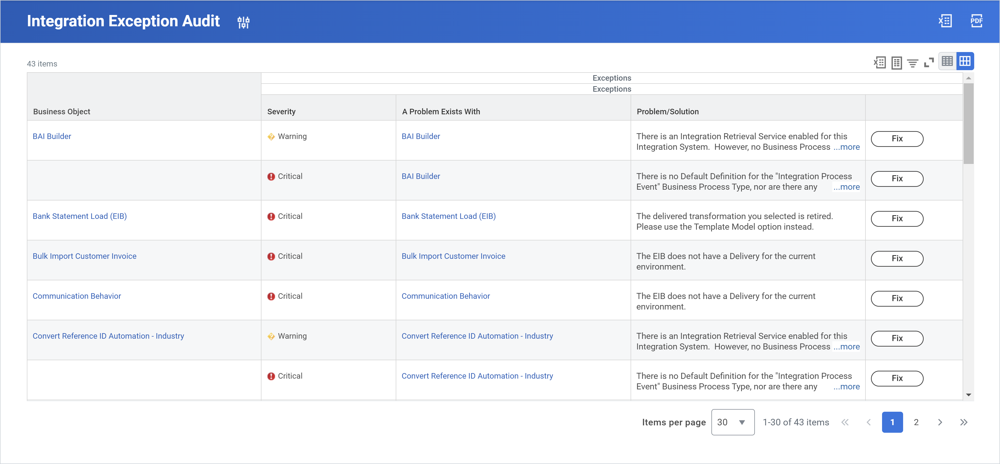
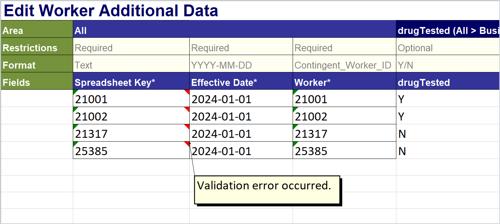

## Testing Integrations

### Integration testing tools

It is important to test integrations as you develop them. Testing integrations can take a variety of forms, but it's important to understand the expected behavior so you can properly validate the data.

#### Testing Inbound EIBs

Select each tab below to learn more about the steps you should take to test an inbound EIB.

- Launch the integration in validation only mode

  Remember to select the Validate Only Load checkbox when launching an inbound EIB to test for errors in the data before uploading it to the system.

- Relaunch the integration in live mode

  If all goes well in Validation Only mode, from the Background Process’s Related Actions, select Integration Event > Relaunch Integration Event.

- Validate the data

  Just because an EIB launches successfully does not mean it achieved the expected results. Depending on the integration system, there will be a variety of ways to validate that the data changed or uploaded as expected in the tenant. You may need to run a report, check the Notifications of certain users, explore worker profiles, or perform a number of other navigation tasks to confirm that your integration works as expected.

#### Testing outbound EIBs

Testing outbound EIBs often involves testing the RaaS report involved to check that the report is properly outputting the data as expected. You may also need to compare an XML file to the report output to validate the data is up to date.

### Activity Notes

#### Activity 1: Tests a spreadsheet

Task 1: Choose a member of the security group

1. Sign in as Logan McNeil (lmcneil).
1. Run the View Security Group report for the HR Administrator security group. You can disregard any errors or alerts that seem unrelated.
1. Expand the Members section.
1. Sign in or start proxy as Joy Banks or Alex Garcia. Alternatively, remain signed in as Logan McNeil, who is also a member of this security group.

Task 2: Launch the integration in validation mode

1. Run the View Integration System report.
1. In the Integration System field, select Manage Goals (EIB) and select OK.
1. From the EIB’s Related Actions, select Integration > Launch / Schedule.
1. Leave the default values and select OK.
1. In the Integration Attachment Value field, select Create Integration Attachment.
1. Drag and drop or select the Select Files button and select the Manage_Goals_Test_Spreadsheet.xlsx file.
1. When uploaded, select OK.
1. Select the Validate Only Load checkbox.
1. Select the Add Errors to Attachment checkbox.
1. Select OK to launch the integration event.
1. Select Refresh until the event completes.
1. Scroll to review the Execution Summary table and verify that all records processed successfully in Validation Only Mode.

Task 3: Relaunch the integration in live mode

1. From the Background Process’s Related Actions, select Integration Event > Relaunch Integration Event.
1. Clear the Validate Only Load checkbox.
1. Select OK to launch the integration event.
1. Select Refresh until the process completes.

Task 4: Validate the data

1. Run the View Goals for Worker report.
1. In the Worker field, search for 21088, which will automatically populate with Christine Nguyen. This was the employee ID that appeared in the spreadsheet we used for this activity.
1. Verify the goals populated according to the test data in the spreadsheet.

#### Activity 2: Test an inbound EIB

Task 1: Choose a member of the security group

1. Sign in as Logan McNeil (lmcneil).
1. Run the View Security Group report for the Learning Administrator security group.
1. Expand the Members section.
1. Start proxy as Alex Garcia, Deborah Simpson, or Henry Lynch. Or, remain signed in as Logan McNeil, who is also a member of this security group.

Task 2: Generate and populate the spreadsheet template

1. Run the View Integration System report.
1. In the Integration System field, select Put Learning Enrollment (EIB).
1. Select OK.
1. From the EIB’s Related Actions, select Template Model > Generate Spreadsheet Template.
1. Select the Confirm checkbox and select Submit.
1. On the View Background Process page, select Refresh until completion.
1. Select the Output Files tab.
1. In the File column, select the link to download the spreadsheet template.
1. Enter the test data and re-save the spreadsheet template.

Task 3: Launch the integration in validation mode

1. Run the View Integration System report.
1. In the Integration System field, select Put Learning Enrollment (EIB).
1. Select OK.
1. From the EIB’s Related Actions, select Integration > Launch / Schedule.
1. Leave the default values and select OK.
1. In the Integration Attachment Value field, select Create Integration Attachment.
1. Drag and drop or select the Select Files button and select the populated spreadsheet template XLSX file.
1. When uploaded, select OK.
1. Select the Validate Only Load checkbox.
1. Select the Add Errors to Attachment checkbox.
1. Select OK to launch the integration event.
1. Select Refresh until the event completes.
1. Scroll to review the Execution Summary table and verify that all records processed successfully in Validation Only Mode.

> Note: If the integration did not launch successfully and you received an error message, view the Failure Report link to check what might have gone wrong. Then, check that the information in the table above was added correctly in your generated spreadsheet. Make any necessary corrections, and try again.

Task 4: Relaunch the integration in live mode

1. From the Background Process’s Related Actions, select Integration Event > Relaunch Integration Event.
1. Clear the Validate Only Load checkbox.
1. Select OK to launch the integration event.
1. Select Refresh until the process completes.

Task 5: Validate the data

1. Run the Learning Enrollments report.
1. Filter the Learning Enrollment Learner column to find Marco Silva and Dylan Johnson.
1. Verify there are learning enrollments with a registration and completion date of 11/15/2023, per the test data.
1. To check that the Enrolled Content is correct, from the enrolled content’s Related Actions, select Integration IDs > View IDs and compare to the test data. The reference IDs should match.

#### Activity 3: Verify the outbound EIB

**Task 1: Launch the EIB**

1. Sign in as Logan McNeil (_lmcneil_).
2. Navigate to the **EIB New Hires - Outbound** integration system.
3. Select the integration system's **Related Actions** and select **Integration** > **Launch / Schedule**.
4. Leave the default values and select **OK**.
5. Enter the following values for the launch parameters:

| **Field Name**     | **Value**  |
| ------------------ | ---------- |
| Starting Hire Date | 01/01/2024 |

6. Select **OK**.
7. On the View Background Process page, select **Refresh** until the integration completes.
8. On the Output Files tab, select the **newhires.csv** file to download it.

**Task 2: Compare to logan's report output**

1. On the Integration Details tab, scroll down to the Enterprise Interface Event section. Under Get Data, notice that the custom report used in the EIB's data source is listed.
2. Select **New Hire Report - Outbound** to view the report.
3. Select the report's **Related Actions** and select **Custom Report** > **Run**.
4. In the Starting Hire Date prompt, enter *01/01/2024*, as that is listed in the latest output file you opened in the previous task.
5. Compare the report output data with the .csv file data.

### Key takeaways

- Always validate data changes when testing an inbound EIB.
- Sometimes you will only have a list of integration IDs to validate data against. If this is the case, you can use a data instance's Related Actions to view its integration IDs. That way, you can verify that the instance matches the data in your spreadsheet.

## Troubleshooting integration issues

Now that you have a basic understanding of how integrations work, you'll learn how to go about troubleshooting them. This lesson is organized into the following topics:

1. Troubleshooting reports
1. Managing business processes
1. Integration event statuses
1. Error message examples
1. Failure reports
1. Edit integration attachments

### Troubleshooting tools

You can use the following reports to help troubleshoot issues with integrations.

- Integration exception audit

  This report summarizes critical errors and warnings for each integration system. It also provides a Fix button to automatically fix the exception or help identify its source.

  

- Scheduled Future EIBs Exception Audit

  This report identifies two security-related exceptions, caused because the user scheduled to run the EIB:

  - Cannot launch the EIB as they do not have the correct domain security. To fix this, modify the user's security permissions or transfer ownership to another user, like an ISU.
  - Cannot complete the EIB as they do not have the correct business process security. To fix this, add the user's security group to the step in the business process security policy or assign a different user to the step.

#### Managing Business Processes

If you need to undo an EIB upload's results, you can cancel or rescind the business processes it triggered. For example, you may need to undo if:

- The business processes completed with errors due to incorrect data.
- Steps in your business process configuration were missing or incorrect.

> 💲Tip: The Mass Cancel Business Processes and Mass Rescind Business Processes tasks enable you to cancel or rescind business processes loaded by inbound EIBs in bulk. Use mass cancel for in-progress processes and mass rescind for completed processes. From either of these tasks, select Business Process Loaded by EIB, then select the EIB whose processes you want to undo.

#### Integration event statuses

- Integration event reports

  Run the Integration Events report for all integration systems or a specific system.

- Related actions

  Go to the integration system's Related Actions and select Integration System > Integration Events to run the Integration Events report for that system.

- Process Monitor report

  Run the Process Monitor report for integration processes.

An integration can have the following statuses:

| Status                                            | Description                                                                              |
| ------------------------------------------------- | ---------------------------------------------------------------------------------------- |
| **Aborted**                                       | Stopped by an integration administrator or implementer.                                  |
| **Completed**                                     | Completed without warnings or errors.                                                    |
| **Completed with Errors**                         | Completed with noncritical and resolvable errors.                                        |
| **Completed with Warnings**                       | Completed with warnings, but not errors, that you may need to resolve.                   |
| **Failed**                                        | Encountered critical error and aborted.                                                  |
| **Not Run due to Exceptions on Future Processes** | Could not run as the integration encountered critical exceptions, e.g., security issues. |
| **Processing**                                    | Currently running.                                                                       |

#### Error message examples

If a piece of data in an EIB integration causes an error, Workday generates an error message, skips that item, and continues to process the other data. Review the table below for examples of error messages and brief resolutions.

| Severity | Message Example                                                                                                                                                                                  | Processing Behavior                                         | Integration Event Status | Resolution                                                                                                                                                                  |
| -------- | ------------------------------------------------------------------------------------------------------------------------------------------------------------------------------------------------ | ----------------------------------------------------------- | ------------------------ | --------------------------------------------------------------------------------------------------------------------------------------------------------------------------- |
| Warning  | Ann Smith has missing or invalid data. The value 1223-456-78910 is too long for “Phone Number” and will be truncated in the output. Phone Number should have length equal to or shorter than 12. | Processing continues.                                       | Completed with Warnings  | Correct the invalid or missing data. Then, run the EIB for only the corrected data.                                                                                         |
| Error    | The worksheet has 51 columns, but should have 52 columns.                                                                                                                                        | Processing continues unless there are more than 500 errors. | Completed with Errors    | Generate the spreadsheet template again and re-enter your data.                                                                                                             |
| Error    | Invalid ID value. '21117' is not a valid ID value for type = 'Contingent_Worker_ID'                                                                                                              | Processing continues unless there are more than 500 errors. | Completed with Errors    | Verify that you used the correct reference ID type. In this example, the reference ID type should be Employee_ID, not Contingent_Worker_ID.                                 |
| Error    | Validation error occurred. Total Time Off for Time Off Entry summing original requested time, previously adjusted time, and current adjustment cannot be negative.                               | Processing continues unless there are more than 500 errors. | Completed with Errors    | The data input for this field is not valid. In this example, the data cannot be negative, so you must make it positive or use another EIB to upload the data as you intend. |
| Critical | Unable to complete integration processing.                                                                                                                                                       | Processing stops.                                           | Failed                   | Discovery why the integration failed. Then, correct it.                                                                                                                     |

#### Failure reports

The Failure Report, located on the integration event, describes any exceptions encountered when running the EIB. 

If you select the **Add Errors to Attachment** launch parameter for an inbound EIB event, Workday creates an Original Data With Errors file. This file is a version of your original EIB file with embedded error comments.

> 💲 Tip: When you download the Original Data With Errors file, you may have to right-click a cell and select Show/Hide Note, then resize the note to view the entire error.

#### Edit integration Attachments

Once you run an EIB with a spreadsheet, Workday stores the spreadsheet. You can upload a new version of the spreadsheet with the Edit Integration Attachment task.

The integration attachment object updates with the name of the new file, if different, and the date and time of the upload.

> ❗Important: Inbound EIBs update Workday data. If you reload the same data, you could create duplicates. To prevent this, delete data or rescind business processes.

**"Completed with Errors indicates that the event completed with noncritical and resolvable errors."**

### Activity Notes

#### Activity 1: Determine why a user cannot launch an EIB

Hint 1: Make sure Ella has access to the Launch / Schedule Integration task.

Hint 2: Make sure Ella has the proper access to the web service used in the integration.

#### Activity 2: Troubleshoot an Error when uploading data

Hint 1:  Launch the EIB in validation mode to identify the errors. You can do this as Logan, or by proxying in as Alex. 

Hint 2: Use the failure reports to identify the source of the error. When you download the Original Data With Errors file, you may have to right-click cell B6 and select Show/Hide Note, then resize the note to view all the data.

Hint 3: Search the Position ID in Workday to find the hiring restrictions and confirm the error.

### Key takeaways

- A user will be unable to launch an integration without access to the web service the integration uses. 
- Use the Add Errors to Attachment launch parameter just in case there are errors with your EIB upload. 
- Sometimes errors with inbound EIBs are due to faulty input data, not the integration system or spreadsheet template itself.

## Summary

1. Describe the Workday integration architecture and integration tools.
1. Create an inbound EIB based on a web services spreadsheet template.
1. Generate a spreadsheet template and load data for a Workday business process using an EIB.
1. Create an outbound EIB using a custom report as a data source.
1. Launch, schedule, and secure EIBs.
1. Test and troubleshoot basic EIBs.
